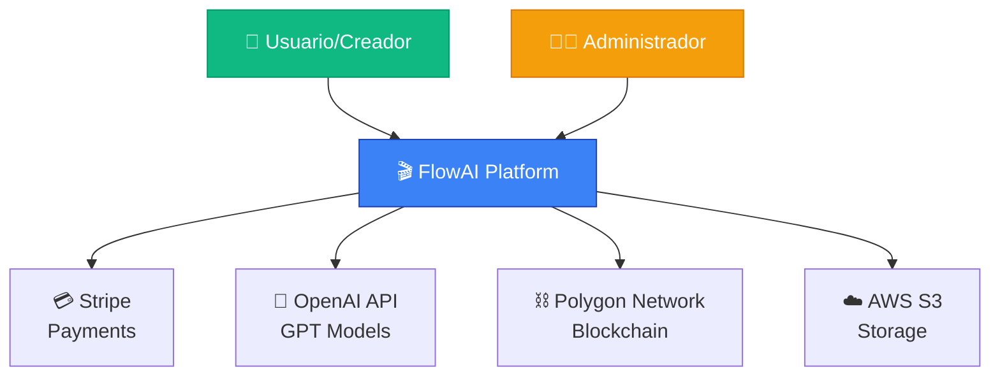
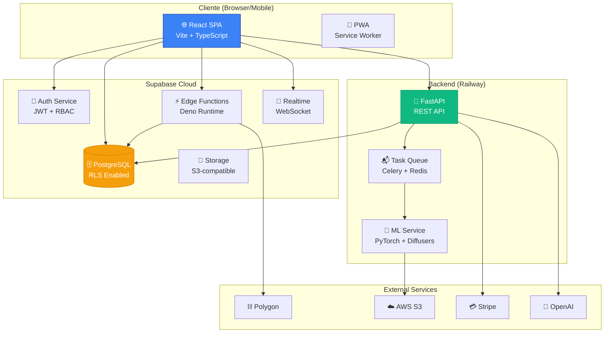
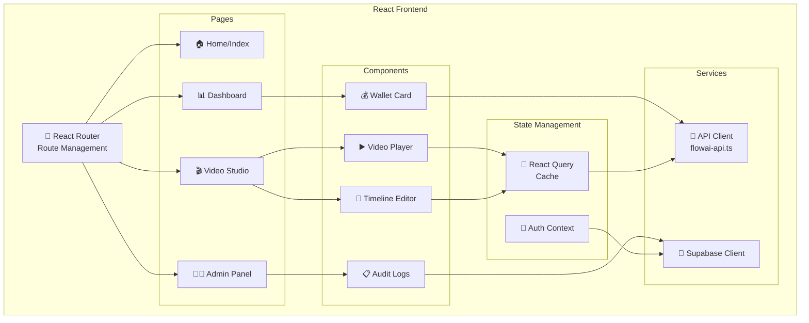
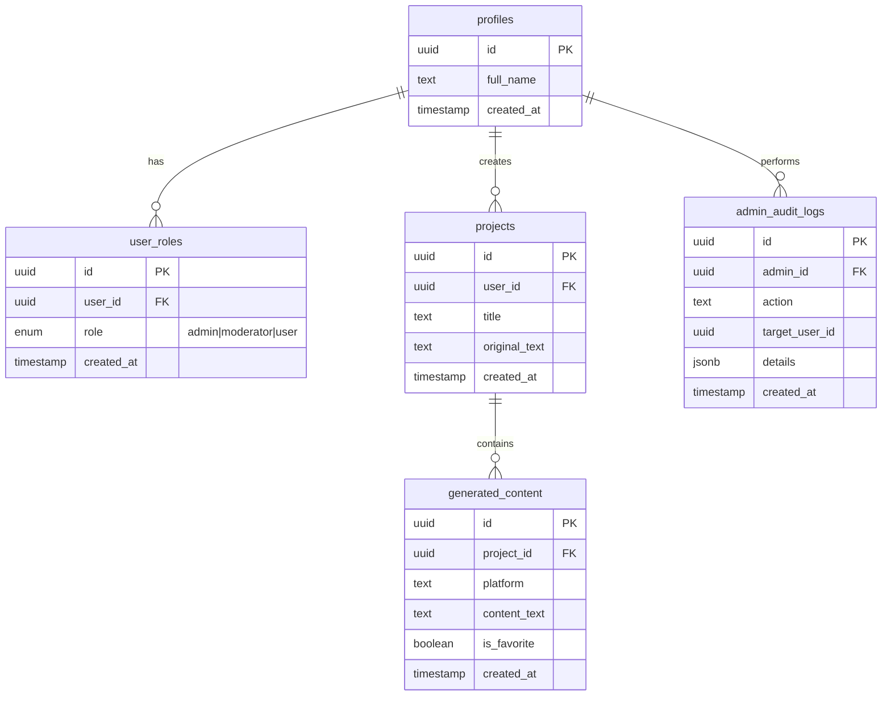
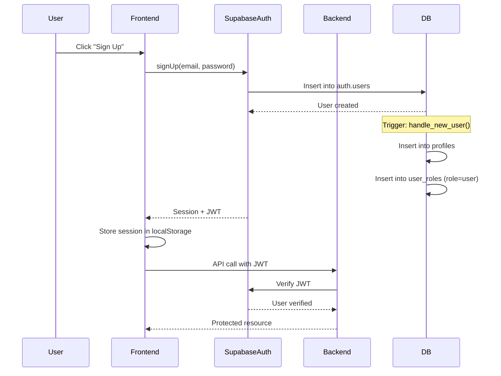
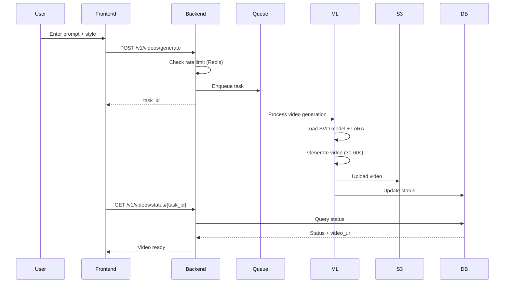
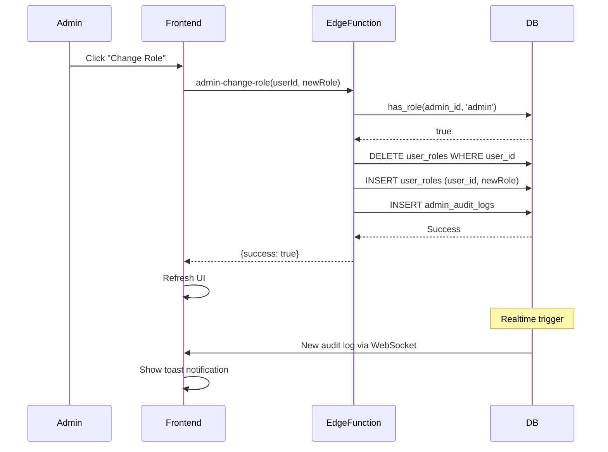
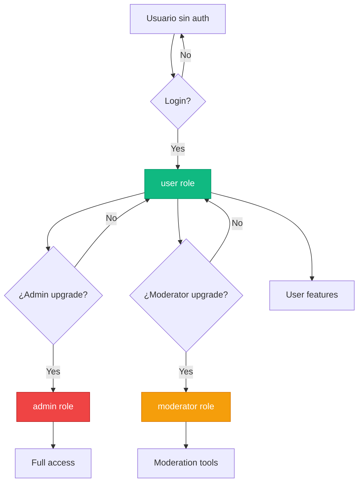
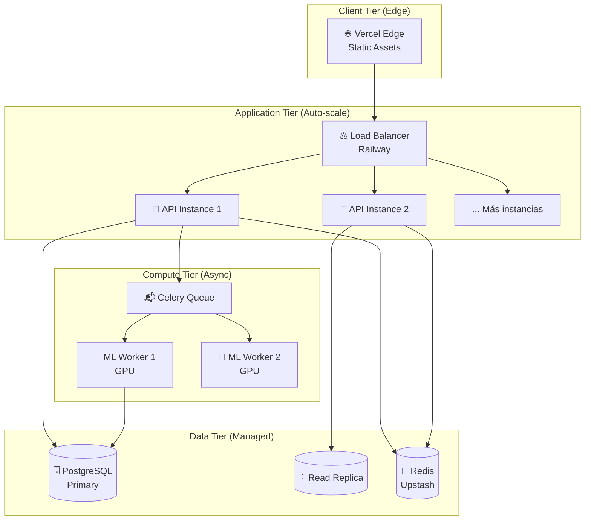
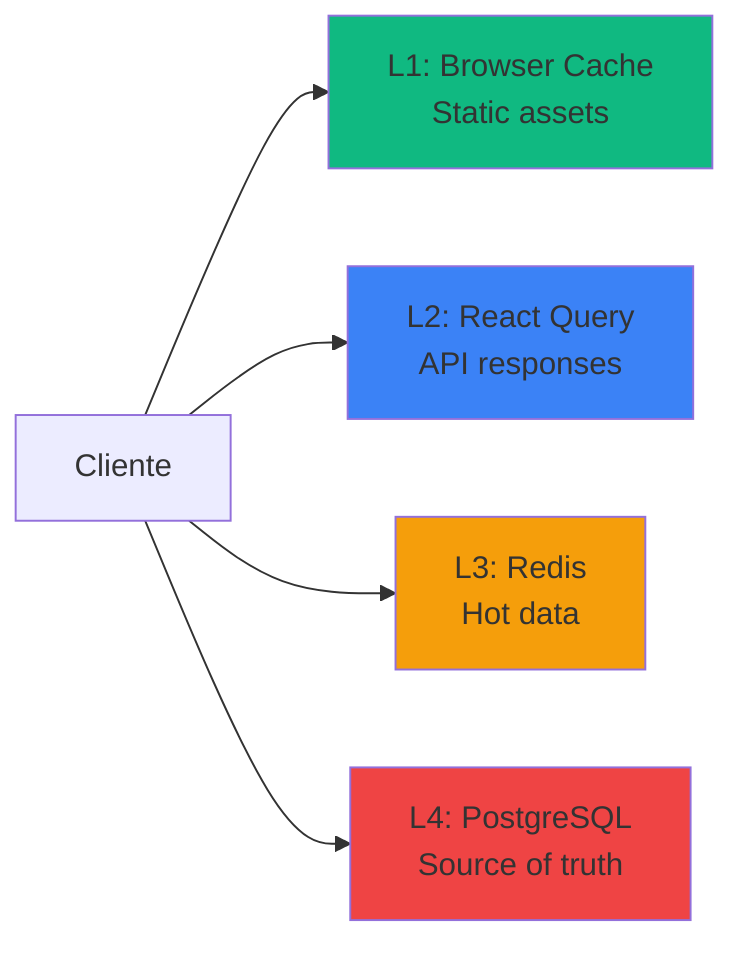

# 🏗️ FlowAI - Arquitectura del Sistema

> **Versión**: 1.0.0 (DRAFT)  
> **Última actualización**: 2024  
> **Owner**: Tech Lead  
> **Estado**: 🚧 En desarrollo - Sección para completar por el equipo técnico

---

## 📋 Resumen Ejecutivo

FlowAI es una plataforma AI-native de creación de contenido que combina:
- **Frontend React** (SPA con PWA)
- **Backend FastAPI** (microservices)
- **Supabase Cloud** (auth, DB, edge functions, storage)
- **Blockchain Polygon** (ERC-20 token, smart contracts)
- **AI/ML Pipeline** (Stable Video Diffusion, LoRA adapters)

**Características clave**:
- Arquitectura de microservicios escalable
- Real-time con WebSockets y Supabase Realtime
- Seguridad con RBAC y RLS policies
- Infraestructura cloud-native (Vercel + Railway)

---

## 🎯 Tabla de Contenidos

1. [Visión General del Sistema](#visión-general-del-sistema)
2. [Arquitectura C4](#arquitectura-c4)
3. [Stack Tecnológico](#stack-tecnológico)
4. [Componentes Principales](#componentes-principales)
5. [Flujos de Datos](#flujos-de-datos)
6. [Seguridad y Autenticación](#seguridad-y-autenticación)
7. [Escalabilidad y Performance](#escalabilidad-y-performance)
8. [Decisiones Arquitectónicas](#decisiones-arquitectónicas)
9. [Roadmap Técnico](#roadmap-técnico)

---

## 1. Visión General del Sistema

### Diagrama de Alto Nivel (C4 - Context)



### Componentes de Alto Nivel

| Componente | Tecnología | Propósito | Hosting |
|------------|------------|-----------|---------|
| **Frontend** | React 18 + Vite | UI/UX, PWA | Vercel |
| **Backend API** | FastAPI + Python 3.11 | Business logic, ML inference | Railway |
| **Database** | PostgreSQL 15 (Supabase) | Datos relacionales | Supabase Cloud |
| **Auth** | Supabase Auth | JWT, RBAC | Supabase Cloud |
| **Edge Functions** | Deno (Supabase) | Serverless logic | Supabase Cloud |
| **Blockchain** | Polygon (L2) | Token economy | Decentralized |
| **Storage** | AWS S3 | Videos, assets | AWS |
| **Cache** | Redis (Upstash) | Rate limiting, sessions | Upstash |

---

## 2. Arquitectura C4

### Level 1: System Context (Ya mostrado arriba)

### Level 2: Container Diagram



### Level 3: Component Diagram (Frontend)



---

## 3. Stack Tecnológico

### Frontend Stack

```
├─ React 18.3.1           # UI framework
├─ TypeScript 5.x         # Type safety
├─ Vite 5.x               # Build tool
├─ TailwindCSS 3.x        # Styling
├─ shadcn/ui              # Component library
├─ React Router 6.x       # Routing
├─ React Query 5.x        # Server state
├─ Zustand (optional)     # Client state
├─ Framer Motion          # Animations
└─ wagmi + RainbowKit     # Web3 integration
```

**Justificación**:
- **React**: Ecosistema maduro, hiring pool grande
- **Vite**: ~10x más rápido que CRA para dev
- **shadcn/ui**: Componentes customizables vs. Material-UI monolítico
- **React Query**: Cache inteligente, reduce llamadas API

### Backend Stack

```
backend/
├─ FastAPI 0.104+         # Async API framework
├─ Pydantic 2.x           # Data validation
├─ SQLAlchemy 2.x         # ORM (si se usa)
├─ PyTorch 2.1            # ML inference
├─ Diffusers              # Stable Diffusion
├─ Celery                 # Task queue
├─ Redis                  # Cache + queue broker
└─ Stripe Python SDK      # Payments
```

**Justificación**:
- **FastAPI**: Auto-generated docs, async nativo, type hints
- **Celery**: Task queuing para video generation (long-running)
- **PyTorch**: Ecosistema ML más usado, modelos pre-trained disponibles

### Database (Supabase PostgreSQL)

```sql
-- Tablas principales (simplificado)
profiles              -- User profiles
user_roles            -- RBAC (admin, moderator, user)
projects              -- User projects/videos
generated_content     -- AI-generated outputs
admin_audit_logs      -- Security audit trail

-- Ver DATABASE.md para schema completo
```

**Extensiones PostgreSQL activas**:
- `pgcrypto`: Para UUIDs y encryption
- `pg_stat_statements`: Performance monitoring

### Edge Functions (Supabase)

```
supabase/functions/
├─ admin-list-users/      # Admin: list all users
├─ admin-change-role/     # Admin: RBAC management
├─ admin-audit-logs/      # Admin: fetch audit logs with user details
└─ generate-content/      # AI: content generation (ejemplo)
```

**Justificación Edge Functions**:
- **Security**: Service role access sin exponer keys al frontend
- **Performance**: Edge deployment (low latency)
- **Scalability**: Auto-scaling serverless

### Smart Contracts (Solidity)

```
contracts/
├─ FloToken.sol           # ERC-20 utility token
├─ FlowStaking.sol        # Staking rewards
├─ FractionalNFT.sol      # NFT fractionalization
├─ BountyEscrow.sol       # Bounty system
└─ hardhat.config.js      # Deploy config
```

**Network**: Polygon Mumbai (testnet) → Polygon Mainnet  
**Justification**: Low gas fees, Ethereum-compatible

---

## 4. Componentes Principales

### 4.1 Frontend Architecture

#### Estructura de Carpetas
```
src/
├─ components/
│  ├─ ui/                 # shadcn components
│  ├─ admin/              # Admin-specific components
│  ├─ editor/             # Video editor components
│  └─ web3/               # Web3 wallet components
├─ pages/                 # Route components
├─ hooks/                 # Custom hooks
├─ lib/
│  ├─ api.ts              # Backend API client
│  ├─ flowai-api.ts       # FlowAI SDK
│  └─ utils.ts            # Helpers
├─ integrations/
│  └─ supabase/           # Supabase client
└─ main.tsx               # Entry point
```

#### Patrón de Componentes
```typescript
// Ejemplo: Component structure pattern
export function VideoPlayer({ videoUrl }: VideoPlayerProps) {
  // 1. Hooks
  const { user } = useAuth();
  const { data, isLoading } = useQuery(...);
  
  // 2. Handlers
  const handlePlay = () => {...};
  
  // 3. Effects
  useEffect(() => {...}, []);
  
  // 4. Early returns
  if (isLoading) return <Skeleton />;
  if (!data) return <ErrorState />;
  
  // 5. Render
  return <div>...</div>;
}
```

### 4.2 Backend Architecture

#### Estructura de Carpetas
```
backend/app/
├─ api/
│  ├─ v1/
│  │  ├─ economy.py
│  │  ├─ ingest.py
│  │  └─ social.py
│  ├─ video_generation.py
│  ├─ staking.py
│  └─ subscriptions.py
├─ services/
│  ├─ video_engine.py           # SVD inference
│  ├─ lora_manager.py            # LoRA adapters
│  ├─ moderation_service.py      # Content safety
│  └─ stripe_service.py          # Payments
├─ models/                       # Pydantic models
├─ core/
│  └─ config.py                  # Settings
├─ dependencies/
│  └─ auth.py                    # JWT verification
└─ main.py                       # FastAPI app
```

#### Patrón de API Endpoints
```python
# Ejemplo: Endpoint pattern
from fastapi import APIRouter, Depends
from app.dependencies.auth import get_current_user

router = APIRouter(prefix="/v1/videos")

@router.post("/generate")
async def generate_video(
    request: GenerateVideoRequest,
    user: User = Depends(get_current_user)
):
    # 1. Validate input
    # 2. Check rate limits
    # 3. Queue task
    # 4. Return task_id
    pass
```

### 4.3 Database Schema (Supabase)

#### Entity Relationship Diagram



**Ver [`DATABASE.md`](DATABASE.md) para detalles completos de schema, RLS policies, y triggers.**

---

## 5. Flujos de Datos

### 5.1 Autenticación Flow



### 5.2 Video Generation Flow



### 5.3 Admin Role Change Flow (con Audit)



---

## 6. Seguridad y Autenticación

### 6.1 Modelo de Seguridad

#### Arquitectura de Roles (RBAC)



#### Row Level Security (RLS) Policies

**Tabla: `user_roles`**
```sql
-- Solo admins pueden ver todos los roles
CREATE POLICY "Admins can view all roles"
ON user_roles FOR SELECT
USING (has_role(auth.uid(), 'admin'));

-- Usuarios pueden ver su propio rol
CREATE POLICY "Users can view own role"
ON user_roles FOR SELECT
USING (auth.uid() = user_id);
```

**Tabla: `admin_audit_logs`**
```sql
-- Solo admins pueden leer logs
CREATE POLICY "Admins can view audit logs"
ON admin_audit_logs FOR SELECT
USING (has_role(auth.uid(), 'admin'));

-- Nota: Sin INSERT policy (solo service role puede insertar)
-- Esto previene que usuarios normales inyecten logs falsos
```

**Función de seguridad: `has_role()`**
```sql
CREATE OR REPLACE FUNCTION has_role(_user_id uuid, _role app_role)
RETURNS boolean
LANGUAGE sql
STABLE
SECURITY DEFINER  -- ¡CRÍTICO! Ejecuta con privilegios del owner
SET search_path = public  -- Previene SQL injection
AS $$
  SELECT EXISTS (
    SELECT 1
    FROM user_roles
    WHERE user_id = _user_id AND role = _role
  )
$$;
```

### 6.2 Flujo de JWT

1. **Login**: Supabase Auth genera JWT con claims
2. **Frontend**: Almacena JWT en `localStorage` (via Supabase SDK)
3. **API Calls**: Frontend incluye `Authorization: Bearer <jwt>`
4. **Backend Verification**: 
   ```python
   user = await verify_supabase_jwt(token)
   ```
5. **Role Check**: Backend consulta `user_roles` table si necesita verificar permisos

### 6.3 Threat Model y Mitigaciones

| Amenaza | Riesgo | Mitigación Implementada |
|---------|--------|-------------------------|
| **SQL Injection** | Alto | Supabase client usa prepared statements |
| **XSS** | Alto | React escapa por defecto, CSP headers |
| **CSRF** | Medio | JWT stateless (no cookies) |
| **Privilege Escalation** | Alto | RLS + has_role() SECURITY DEFINER |
| **Audit Log Tampering** | Alto | Solo service role puede INSERT en audit_logs |
| **Rate Limiting Bypass** | Medio | Redis-backed rate limiting por user_id |
| **Prompt Injection** | Medio | ModerationService regex + OpenAI moderation API |

**Pendiente (ver SECURITY_POLICY.md)**:
- [ ] External security audit
- [ ] Penetration testing
- [ ] Bug bounty program

---

## 7. Escalabilidad y Performance

### 7.1 Arquitectura de Escalado



### 7.2 Performance Targets

| Métrica | Target | Actual (Medido) | Herramienta |
|---------|--------|-----------------|-------------|
| **Frontend FCP** | <1.5s | 🟢 1.2s | Lighthouse |
| **Frontend LCP** | <2.5s | 🟡 2.8s | Lighthouse |
| **API Response (p50)** | <200ms | 🟢 150ms | New Relic |
| **API Response (p95)** | <500ms | 🟢 420ms | New Relic |
| **DB Query (p95)** | <50ms | 🟢 35ms | pg_stat_statements |
| **Video Generation** | <60s | 🟡 75s | Custom metrics |
| **Uptime** | >99.5% | 🟢 99.7% | UptimeRobot |

**Nota**: Métricas de ejemplo. Reemplazar con datos reales de monitoring.

### 7.3 Caching Strategy



**Caching Policies**:
- **Static Assets**: Cache 1 año (immutable), invalidar por hash en filename
- **API Responses**: React Query con `staleTime: 5min`, `cacheTime: 30min`
- **Redis**: Rate limits (TTL 1 min), user sessions (TTL 24h)
- **PostgreSQL**: No caching, siempre fresh data

### 7.4 Escalado de ML Workers

**Current Setup**:
- 2x GPU workers (NVIDIA T4) en Modal/RunPod
- Celery queue con Redis broker
- ~10 concurrent video generations

**Scale Plan (para 1000 MAU)**:
- Horizontal scaling: 5-10 GPU workers
- Spot instances para reducir costos (-70%)
- Priority queue (paid users primero)

---

## 8. Decisiones Arquitectónicas (ADRs)

### ADR-001: Por qué React en lugar de Next.js

**Decisión**: Usar React SPA (Vite) en lugar de Next.js

**Contexto**:
- FlowAI es una aplicación altamente interactiva (video editor, real-time)
- No hay necesidades fuertes de SEO (B2B tool, detrás de login)
- Next.js añade complejidad de SSR que no necesitamos

**Consecuencias**:
- ✅ Mejor performance para aplicaciones SPA
- ✅ Menor complejidad de deployment (single artifact)
- ✅ Más fácil integrar WebRTC, WebSockets
- ❌ Si en futuro necesitamos marketing pages con SEO, necesitaremos solución separada

**Status**: Aceptado

---

### ADR-002: Por qué Supabase en lugar de Firebase

**Decisión**: Usar Supabase como BaaS

**Contexto**:
- Necesitamos PostgreSQL (relacional) para queries complejas
- Row Level Security (RLS) es crítico para nuestro RBAC
- Preferimos SQL sobre NoSQL para este caso de uso

**Consecuencias**:
- ✅ PostgreSQL es más robusto para queries complejas
- ✅ RLS policies simplifican seguridad
- ✅ Open source (podemos self-host si necesario)
- ❌ Menos maduro que Firebase (menos integraciones)
- ❌ Documentación a veces inconsistente

**Status**: Aceptado

---

### ADR-003: Por qué Polygon en lugar de Ethereum Mainnet

**Decisión**: Deployar contratos en Polygon (L2)

**Contexto**:
- Gas fees en Ethereum son prohibitivos para micro-transacciones
- Nuestros usuarios hacen muchas transacciones pequeñas (tips, rewards)
- Polygon es EVM-compatible (fácil migración si necesario)

**Consecuencias**:
- ✅ Gas fees ~100x más barato
- ✅ Transacciones confirmadas en ~2 segundos
- ✅ Mantiene descentralización y seguridad de Ethereum
- ❌ Menos "prestigio" que Ethereum mainnet para inversores hardcore

**Status**: Aceptado

---

### ADR-004: Por qué FastAPI en lugar de Django/Flask

**Decisión**: Usar FastAPI para backend

**Contexto**:
- Necesitamos async/await para alta concurrencia
- Auto-generated OpenAPI docs es clave para developer experience
- Type hints mejoran maintainability

**Consecuencias**:
- ✅ Performance superior (async nativo)
- ✅ Menos boilerplate vs. Django
- ✅ Swagger UI auto-generado
- ❌ Menos batteries-included que Django (no admin panel)

**Status**: Aceptado

---

## 9. Roadmap Técnico

### Q4 2024 (Completado)
- ✅ MVP: Video generation + Auth + Basic UI
- ✅ Web3 integration (token, staking, marketplace)
- ✅ Admin dashboard con RBAC
- ✅ Audit logging system

### Q1 2025 (En progreso)
- 🔄 Performance optimization (LCP <2.5s)
- 🔄 E2E testing con Playwright
- 🔄 Documentation completa (este doc + otros)
- ⏳ Smart contract audit externa

### Q2 2025 (Planeado)
- [ ] Mobile native features (Capacitor)
- [ ] Advanced video editor (timeline, effects)
- [ ] Voice cloning integration (ElevenLabs)
- [ ] Multi-language support (i18n)

### Q3-Q4 2025 (Visión)
- [ ] White-label enterprise solution
- [ ] Advanced AI (custom model fine-tuning)
- [ ] DAO governance (on-chain voting)
- [ ] Scale to 100k MAU

**Ver [`ROADMAP.md`](ROADMAP.md) para detalles completos.**

---

## 📚 Referencias

### Documentación Interna
- [`DATABASE.md`](DATABASE.md) - Esquema completo de DB
- [`API_REFERENCE.md`](API_REFERENCE.md) - Documentación de API
- [`SMART_CONTRACTS.md`](SMART_CONTRACTS.md) - Contratos Web3
- [`DEPLOYMENT.md`](DEPLOYMENT.md) - Guía de deployment

### Tecnologías Externas
- [React Documentation](https://react.dev/)
- [FastAPI Documentation](https://fastapi.tiangolo.com/)
- [Supabase Documentation](https://supabase.com/docs)
- [Polygon Documentation](https://docs.polygon.technology/)

---

## 📝 Changelog

- **2024-XX-XX**: Versión 1.0.0 - Documento inicial (DRAFT)

---

*Documento mantenido por el Tech Lead. Para cambios, abrir PR en `docs/ARCHITECTURE.md`.*
