# 🤝 AI Brand Deal Matchmaking - Technical Documentation

> **Feature**: AI Brand Deal Matchmaking  
> **Version**: 1.0.0  
> **Last Updated**: 2025-12-08  
> **Status**: ✅ Implemented

---

## Overview

AI-powered matchmaking platform connecting creators with brand partnership opportunities. Uses content niche analysis, audience metrics, and engagement data to calculate optimal matches between creators and campaigns.

---

## Architecture

```mermaid
graph TB
    subgraph "Creator Side"
        A[Media Kit] --> B[Matching Engine]
    end
    
    subgraph "Brand Side"
        C[Campaign] --> B
    end
    
    B --> D[Match Score 0-100]
    D --> E[Deal Creation]
    E --> F[Workflow: Pending → Completed]
    F --> G[Payment Release]
```



---

## Database Schema

| Table | Purpose |
|-------|---------|
| `brand_profiles` | Company accounts and branding |
| `creator_media_kits` | Creator portfolios and rates |
| `brand_campaigns` | Active partnership opportunities |
| `brand_deals` | Matched partnerships and status |
| `deal_messages` | In-deal communication |
| `ai_match_suggestions` | AI-generated recommendations |

---

## Match Scoring Algorithm

| Factor | Points | Criteria |
|--------|--------|----------|
| Followers | 30 | Within campaign range |
| Niche Match | 40 | Content niches overlap |
| Engagement | 20 | Rate ≥3% = full points |
| Ratings | 10 | ≥4.5★ = full points |

```sql
-- Score = SUM(follower_score + niche_score + engagement_score + rating_score)
-- Range: 0-100%, higher = better match
```

---

## Deal Status Workflow

```
pending → negotiating → accepted → in_progress → review → approved → published → completed
                   ↓                                 ↓
              cancelled                    revision_requested
```

---

## API Reference

**Endpoint**: `POST /functions/v1/brand-deals`

| Action | Description |
|--------|-------------|
| `get_matching_campaigns` | Get AI-matched campaigns for creator |
| `apply_to_campaign` | Submit application to brand |
| `get_my_deals` | List creator's active deals |
| `get_campaign_applications` | List applications for brand's campaign |
| `update_deal_status` | Progress deal through workflow |
| `send_message` | Send message within deal |

---

## Revenue Model

| Party | Cut |
|-------|-----|
| Creator | 85% |
| Platform | 15% |

---

## Files Created

| File | Purpose |
|------|---------|
| [20251208170400_brand_deal_matchmaking.sql](file:///c:/Users/Manu/FlowAI/flowaicontent-10/supabase/migrations/20251208170400_brand_deal_matchmaking.sql) | Database schema |
| [brand-deals/index.ts](file:///c:/Users/Manu/FlowAI/flowaicontent-10/supabase/functions/brand-deals/index.ts) | API endpoint |
| [BrandDealsMarketplace.tsx](file:///c:/Users/Manu/FlowAI/flowaicontent-10/src/pages/BrandDealsMarketplace.tsx) | Creator UI |

---

## Route: `/brand-deals`

---

## Deployment

```bash
npx supabase db push
npx supabase functions deploy brand-deals
```
