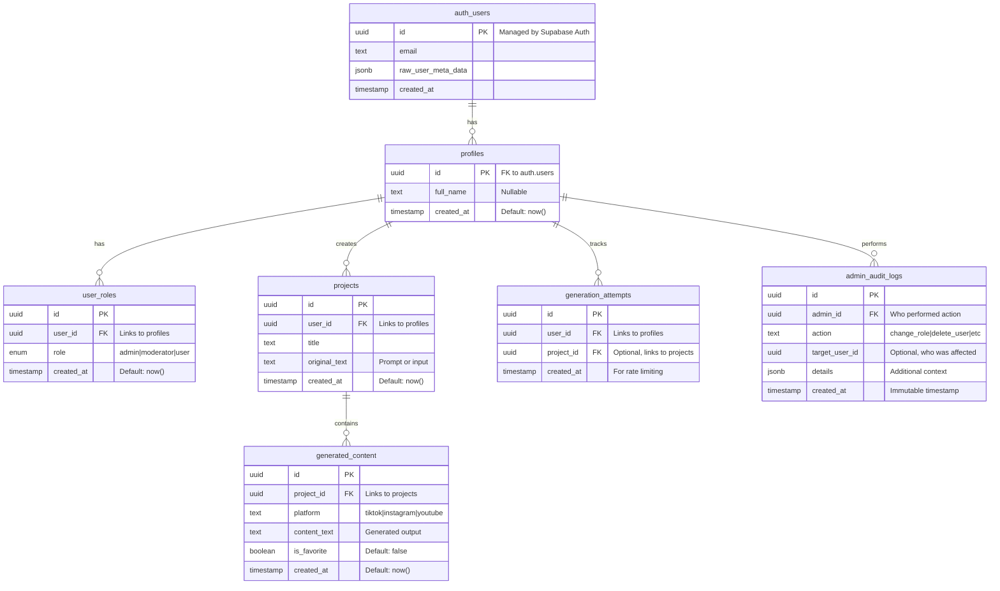

# 🗄️ FlowAI - Database Documentation

> **Versión**: 1.0.0  
> **Database**: PostgreSQL 15 (Supabase)  
> **Última actualización**: 2024  
> **Owner**: Backend Lead

---

## 📋 Resumen Ejecutivo

FlowAI utiliza PostgreSQL 15 hospedado en Supabase Cloud con:
- **6 tablas principales** en schema `public`
- **Row Level Security (RLS)** habilitado en todas las tablas
- **18 policies** para control de acceso granular
- **3 funciones SQL** (has_role, handle_new_user, handle_new_user_role)
- **2 triggers** para auto-creación de profiles y roles

**Diseño Principles**:
- Security-first (RLS en todo)
- UUID primary keys (privacy + distribution-friendly)
- Timestamps con timezone (UTC)
- JSONB para datos flexibles
- Foreign keys con CASCADE para data integrity

---

## 🎯 Tabla de Contenidos

1. [Diagrama ER Completo](#1-diagrama-er-completo)
2. [Schema por Tabla](#2-schema-por-tabla)
3. [RLS Policies](#3-rls-policies)
4. [Funciones SQL](#4-funciones-sql)
5. [Triggers](#5-triggers)
6. [Índices y Performance](#6-índices-y-performance)
7. [Migraciones](#7-migraciones)
8. [Backup y Recovery](#8-backup-y-recovery)

---

## 1. Diagrama ER Completo

### 1.1 Entity Relationship Diagram



### 1.2 Relaciones Clave

| Parent | Child | Relationship | Cascade |
|--------|-------|--------------|---------|
| `auth.users` | `profiles` | 1:1 | ON DELETE CASCADE |
| `profiles` | `user_roles` | 1:1 | Implicit (unique constraint) |
| `profiles` | `projects` | 1:N | No explicit FK |
| `projects` | `generated_content` | 1:N | ON DELETE CASCADE |
| `profiles` | `generation_attempts` | 1:N | No explicit FK |
| `profiles` | `admin_audit_logs` | 1:N | No explicit FK |

**⚠️ Nota sobre Foreign Keys**:
- `profiles.id` NO tiene FK explícito a `auth.users.id` (manejado por trigger)
- `user_roles`, `projects`, `generation_attempts`, `admin_audit_logs` NO tienen FKs explícitos (por diseño de Supabase, se manejan via RLS)

---

## 2. Schema por Tabla

### 2.1 `profiles`

**Propósito**: Información adicional de usuario más allá de auth

```sql
CREATE TABLE public.profiles (
    id uuid PRIMARY KEY,                    -- Same as auth.users.id
    full_name text,                          -- Display name
    created_at timestamptz NOT NULL DEFAULT now()
);

-- Enable RLS
ALTER TABLE public.profiles ENABLE ROW LEVEL SECURITY;
```

**Columnas**:
| Columna | Tipo | Nullable | Default | Descripción |
|---------|------|----------|---------|-------------|
| `id` | uuid | NO | - | PK, matches auth.users.id |
| `full_name` | text | YES | NULL | User's display name |
| `created_at` | timestamptz | NO | now() | Account creation time |

**Índices**:
- `profiles_pkey` (PRIMARY KEY on `id`)

**RLS Policies** (3):
1. Users can insert own profile
2. Users can update own profile
3. Users can view own profile

**Trigger**:
- `on_auth_user_created` → Automatically inserts row when user signs up

**Sample Data**:
```sql
INSERT INTO profiles (id, full_name) VALUES
('123e4567-e89b-12d3-a456-426614174000', 'Alice Creator'),
('234e5678-e89b-12d3-a456-426614174001', 'Bob Viewer');
```

---

### 2.2 `user_roles`

**Propósito**: RBAC (Role-Based Access Control) para admin/moderator/user

```sql
-- Create enum first
CREATE TYPE public.app_role AS ENUM ('admin', 'moderator', 'user');

CREATE TABLE public.user_roles (
    id uuid PRIMARY KEY DEFAULT gen_random_uuid(),
    user_id uuid NOT NULL,                   -- Links to profiles.id
    role app_role NOT NULL,                  -- admin, moderator, or user
    created_at timestamptz DEFAULT now(),
    UNIQUE(user_id, role)                    -- One role per user
);

ALTER TABLE public.user_roles ENABLE ROW LEVEL SECURITY;
```

**Columnas**:
| Columna | Tipo | Nullable | Default | Descripción |
|---------|------|----------|---------|-------------|
| `id` | uuid | NO | gen_random_uuid() | PK |
| `user_id` | uuid | NO | - | FK to profiles (implicit) |
| `role` | app_role | NO | - | Enum: admin, moderator, user |
| `created_at` | timestamptz | YES | now() | Role assignment time |

**Índices**:
- `user_roles_pkey` (PRIMARY KEY on `id`)
- `user_roles_user_id_role_key` (UNIQUE on `user_id`, `role`)

**RLS Policies** (5):
1. Admins can view all roles
2. Users can view their own roles
3. Admins can insert roles
4. Admins can update roles
5. Admins can delete roles

**Trigger**:
- `on_auth_user_created_role` → Automatically inserts `role='user'` on signup

**Sample Data**:
```sql
INSERT INTO user_roles (user_id, role) VALUES
('123e4567-e89b-12d3-a456-426614174000', 'admin'),
('234e5678-e89b-12d3-a456-426614174001', 'user');
```

---

### 2.3 `projects`

**Propósito**: User projects/videos (container for generated content)

```sql
CREATE TABLE public.projects (
    id uuid PRIMARY KEY DEFAULT gen_random_uuid(),
    user_id uuid NOT NULL,                   -- Owner
    title text NOT NULL,                     -- Project name
    original_text text NOT NULL,             -- Input prompt/text
    created_at timestamptz NOT NULL DEFAULT now()
);

ALTER TABLE public.projects ENABLE ROW LEVEL SECURITY;
```

**Columnas**:
| Columna | Tipo | Nullable | Default | Descripción |
|---------|------|----------|---------|-------------|
| `id` | uuid | NO | gen_random_uuid() | PK |
| `user_id` | uuid | NO | - | FK to profiles (owner) |
| `title` | text | NO | - | Project title |
| `original_text` | text | NO | - | Original prompt/input |
| `created_at` | timestamptz | NO | now() | Creation timestamp |

**Índices**:
- `projects_pkey` (PRIMARY KEY on `id`)
- **Recomendado**: `CREATE INDEX idx_projects_user_id ON projects(user_id);` (para queries por usuario)

**RLS Policies** (4):
1. Users can view own projects
2. Users can create own projects
3. Users can update own projects
4. Users can delete own projects

**Use Case**:
```
User creates project:
- Title: "Cyberpunk Short Film"
- Original Text: "A rainy cyberpunk city at night with neon signs"
- ID: project_123

Then generates multiple variations:
- TikTok version (9:16)
- YouTube Shorts version (9:16)
- Instagram Reels version (9:16)
All link to project_123
```

**Sample Data**:
```sql
INSERT INTO projects (user_id, title, original_text) VALUES
('123e4567-e89b-12d3-a456-426614174000', 
 'Epic Dragon Battle', 
 'A dragon fighting a knight in a medieval castle');
```

---

### 2.4 `generated_content`

**Propósito**: AI-generated outputs (videos, images, etc) linked to projects

```sql
CREATE TABLE public.generated_content (
    id uuid PRIMARY KEY DEFAULT gen_random_uuid(),
    project_id uuid NOT NULL,                -- Links to projects
    platform text NOT NULL,                  -- tiktok, instagram, youtube
    content_text text NOT NULL,              -- Generated output or URL
    is_favorite boolean NOT NULL DEFAULT false,
    created_at timestamptz NOT NULL DEFAULT now(),
    FOREIGN KEY (project_id) REFERENCES projects(id) ON DELETE CASCADE
);

ALTER TABLE public.generated_content ENABLE ROW LEVEL SECURITY;
```

**Columnas**:
| Columna | Tipo | Nullable | Default | Descripción |
|---------|------|----------|---------|-------------|
| `id` | uuid | NO | gen_random_uuid() | PK |
| `project_id` | uuid | NO | - | FK to projects |
| `platform` | text | NO | - | Target platform |
| `content_text` | text | NO | - | Output or S3 URL |
| `is_favorite` | boolean | NO | false | User-marked favorite |
| `created_at` | timestamptz | NO | now() | Generation timestamp |

**Índices**:
- `generated_content_pkey` (PRIMARY KEY on `id`)
- **Recomendado**: 
  - `CREATE INDEX idx_generated_content_project_id ON generated_content(project_id);`
  - `CREATE INDEX idx_generated_content_is_favorite ON generated_content(is_favorite) WHERE is_favorite = true;`

**RLS Policies** (4):
1. Users can view own generated content (via project ownership)
2. Users can create own generated content
3. Users can update own generated content
4. Users can delete own generated content

**Platform Values**:
```sql
-- Valid platforms (not enforced by enum, but convention):
'tiktok'
'instagram'  
'youtube'
'twitter'
'custom'
```

**Sample Data**:
```sql
INSERT INTO generated_content (project_id, platform, content_text) VALUES
('project_123', 'tiktok', 's3://flowai-videos/dragon_battle_tiktok.mp4'),
('project_123', 'youtube', 's3://flowai-videos/dragon_battle_youtube.mp4');
```

---

### 2.5 `generation_attempts`

**Propósito**: Rate limiting - track number of generations per user

```sql
CREATE TABLE public.generation_attempts (
    id uuid PRIMARY KEY DEFAULT gen_random_uuid(),
    user_id uuid NOT NULL,                   -- Who attempted
    project_id uuid,                         -- Optional: which project
    created_at timestamptz NOT NULL DEFAULT now()
);

ALTER TABLE public.generation_attempts ENABLE ROW LEVEL SECURITY;
```

**Columnas**:
| Columna | Tipo | Nullable | Default | Descripción |
|---------|------|----------|---------|-------------|
| `id` | uuid | NO | gen_random_uuid() | PK |
| `user_id` | uuid | NO | - | FK to profiles |
| `project_id` | uuid | YES | NULL | Optional FK to projects |
| `created_at` | timestamptz | NO | now() | Attempt timestamp |

**Índices**:
- `generation_attempts_pkey` (PRIMARY KEY on `id`)
- **Crítico**: `CREATE INDEX idx_generation_attempts_user_created ON generation_attempts(user_id, created_at DESC);`

**RLS Policies** (2):
1. Users can view own generation attempts
2. Users can insert own generation attempts

**Use Case (Rate Limiting)**:
```sql
-- Check if user exceeded daily limit (10 gens for FREE tier)
SELECT COUNT(*) 
FROM generation_attempts
WHERE user_id = $1 
  AND created_at >= NOW() - INTERVAL '24 hours';

-- If count < 10: Allow generation
-- If count >= 10: Show "Upgrade to PRO" modal
```

**Sample Query**:
```sql
-- Get user's generation history (last 7 days)
SELECT 
    DATE(created_at) as date,
    COUNT(*) as attempts
FROM generation_attempts
WHERE user_id = '123e4567-e89b-12d3-a456-426614174000'
  AND created_at >= NOW() - INTERVAL '7 days'
GROUP BY DATE(created_at)
ORDER BY date DESC;
```

---

### 2.6 `admin_audit_logs`

**Propósito**: Security audit trail for admin actions (immutable log)

```sql
CREATE TABLE public.admin_audit_logs (
    id uuid PRIMARY KEY DEFAULT gen_random_uuid(),
    admin_id uuid NOT NULL,                  -- Who performed action
    action text NOT NULL,                    -- change_role, delete_user, etc
    target_user_id uuid,                     -- Who was affected (nullable)
    details jsonb,                           -- Additional context
    created_at timestamptz NOT NULL DEFAULT now()
);

ALTER TABLE public.admin_audit_logs ENABLE ROW LEVEL SECURITY;
```

**Columnas**:
| Columna | Tipo | Nullable | Default | Descripción |
|---------|------|----------|---------|-------------|
| `id` | uuid | NO | gen_random_uuid() | PK |
| `admin_id` | uuid | NO | - | FK to profiles (admin) |
| `action` | text | NO | - | Action performed |
| `target_user_id` | uuid | YES | NULL | Affected user |
| `details` | jsonb | YES | NULL | Extra metadata |
| `created_at` | timestamptz | NO | now() | Immutable timestamp |

**Índices**:
- `admin_audit_logs_pkey` (PRIMARY KEY on `id`)
- **Recomendado**:
  - `CREATE INDEX idx_admin_audit_logs_admin_id ON admin_audit_logs(admin_id);`
  - `CREATE INDEX idx_admin_audit_logs_created_at ON admin_audit_logs(created_at DESC);`
  - `CREATE INDEX idx_admin_audit_logs_action ON admin_audit_logs(action);`

**RLS Policies** (1):
1. Admins can view audit logs (SELECT only)

**⚠️ Security Note**: 
- **NO INSERT policy** (solo service role puede insertar desde edge functions)
- **NO UPDATE/DELETE policies** (logs son immutables)
- **Realtime enabled** para notificaciones en tiempo real

**Action Types** (convención, no enum):
```
'change_role'       -- Modified user role
'delete_user'       -- Deleted user account
'suspend_user'      -- Suspended user
'ban_content'       -- Removed content
'update_settings'   -- Changed platform settings
```

**Sample Data**:
```sql
INSERT INTO admin_audit_logs (admin_id, action, target_user_id, details) VALUES
('admin_uuid', 'change_role', 'user_uuid', 
 '{"old_role": "user", "new_role": "moderator"}'::jsonb);
```

**Realtime Setup**:
```sql
-- Enable realtime for admin_audit_logs
ALTER TABLE public.admin_audit_logs REPLICA IDENTITY FULL;
ALTER PUBLICATION supabase_realtime ADD TABLE public.admin_audit_logs;
```

---

## 3. RLS Policies

### 3.1 Resumen de Policies por Tabla

| Tabla | Policies | SELECT | INSERT | UPDATE | DELETE |
|-------|----------|--------|--------|--------|--------|
| `profiles` | 3 | Owner | Owner | Owner | - |
| `user_roles` | 5 | Admin+Owner | Admin | Admin | Admin |
| `projects` | 4 | Owner | Owner | Owner | Owner |
| `generated_content` | 4 | Owner (via project) | Owner | Owner | Owner |
| `generation_attempts` | 2 | Owner | Owner | - | - |
| `admin_audit_logs` | 1 | Admin | - | - | - |
| **TOTAL** | **19** | 7 | 6 | 4 | 2 |

### 3.2 Profiles Policies

#### Policy 1: `Users can view own profile`
```sql
CREATE POLICY "Users can view own profile"
ON public.profiles FOR SELECT
USING (auth.uid() = id);
```

**Permite**: Usuario ver su propio perfil  
**Bloquea**: Ver perfiles de otros usuarios

#### Policy 2: `Users can insert own profile`
```sql
CREATE POLICY "Users can insert own profile"
ON public.profiles FOR INSERT
WITH CHECK (auth.uid() = id);
```

**Permite**: Usuario crear su propio perfil (triggered automáticamente)  
**Bloquea**: Crear perfiles para otros usuarios

#### Policy 3: `Users can update own profile`
```sql
CREATE POLICY "Users can update own profile"
ON public.profiles FOR UPDATE
USING (auth.uid() = id);
```

**Permite**: Usuario actualizar su `full_name`  
**Bloquea**: Actualizar perfiles ajenos

---

### 3.3 User Roles Policies

#### Policy 1: `Admins can view all roles`
```sql
CREATE POLICY "Admins can view all roles"
ON public.user_roles FOR SELECT
USING (has_role(auth.uid(), 'admin'::app_role));
```

**Permite**: Admins ver todos los roles (para dashboard)  
**Usa**: `has_role()` function (SECURITY DEFINER)

#### Policy 2: `Users can view their own roles`
```sql
CREATE POLICY "Users can view their own roles"
ON public.user_roles FOR SELECT
USING (auth.uid() = user_id);
```

**Permite**: Usuario ver su propio rol  
**Use Case**: Frontend muestra "You are a PRO user"

#### Policy 3: `Admins can insert roles`
```sql
CREATE POLICY "Admins can insert roles"
ON public.user_roles FOR INSERT
WITH CHECK (has_role(auth.uid(), 'admin'::app_role));
```

**Permite**: Admins asignar roles a usuarios  
**Bloquea**: Usuarios auto-promoviendo a admin

#### Policy 4: `Admins can update roles`
```sql
CREATE POLICY "Admins can update roles"
ON public.user_roles FOR UPDATE
USING (has_role(auth.uid(), 'admin'::app_role));
```

**Permite**: Admins cambiar rol de usuario  
**Use Case**: Promover moderator → admin

#### Policy 5: `Admins can delete roles`
```sql
CREATE POLICY "Admins can delete roles"
ON public.user_roles FOR DELETE
USING (has_role(auth.uid(), 'admin'::app_role));
```

**Permite**: Admins remover roles (ej: degradar admin → user)

---

### 3.4 Projects Policies

#### Policy 1: `Users can view own projects`
```sql
CREATE POLICY "Users can view own projects"
ON public.projects FOR SELECT
USING (auth.uid() = user_id);
```

#### Policy 2: `Users can create own projects`
```sql
CREATE POLICY "Users can create own projects"
ON public.projects FOR INSERT
WITH CHECK (auth.uid() = user_id);
```

#### Policy 3: `Users can update own projects`
```sql
CREATE POLICY "Users can update own projects"
ON public.projects FOR UPDATE
USING (auth.uid() = user_id);
```

#### Policy 4: `Users can delete own projects`
```sql
CREATE POLICY "Users can delete own projects"
ON public.projects FOR DELETE
USING (auth.uid() = user_id);
```

**Note**: Deleting project CASCADE deletes all `generated_content` for that project

---

### 3.5 Generated Content Policies

#### Policy 1: `Users can view own generated content`
```sql
CREATE POLICY "Users can view own generated content"
ON public.generated_content FOR SELECT
USING (
    EXISTS (
        SELECT 1 FROM projects
        WHERE projects.id = generated_content.project_id
          AND projects.user_id = auth.uid()
    )
);
```

**Complejidad**: Requiere JOIN con projects para verificar ownership

#### Policy 2-4: Similar pattern para INSERT, UPDATE, DELETE

---

### 3.6 Generation Attempts Policies

#### Policy 1: `Users can view own generation attempts`
```sql
CREATE POLICY "Users can view own generation attempts"
ON public.generation_attempts FOR SELECT
USING (auth.uid() = user_id);
```

#### Policy 2: `Users can insert own generation attempts`
```sql
CREATE POLICY "Users can insert own generation attempts"
ON public.generation_attempts FOR INSERT
WITH CHECK (auth.uid() = user_id);
```

**Note**: No UPDATE/DELETE policies (rate limit log es append-only)

---

### 3.7 Admin Audit Logs Policies

#### Policy 1: `Admins can view audit logs`
```sql
CREATE POLICY "Admins can view audit logs"
ON public.admin_audit_logs FOR SELECT
USING (has_role(auth.uid(), 'admin'::app_role));
```

**Critical**: 
- Solo SELECT policy existe
- NO INSERT policy (solo service role puede insertar desde edge functions)
- NO UPDATE/DELETE policies (logs inmutables)

---

## 4. Funciones SQL

### 4.1 `has_role()`

**Propósito**: Verificar si un usuario tiene un rol específico (usado en RLS policies)

```sql
CREATE OR REPLACE FUNCTION public.has_role(_user_id uuid, _role app_role)
RETURNS boolean
LANGUAGE sql
STABLE                          -- Result doesn't change within transaction
SECURITY DEFINER                -- Ejecuta con privilegios del owner (bypasses RLS)
SET search_path = public        -- Previene SQL injection
AS $$
  SELECT EXISTS (
    SELECT 1
    FROM public.user_roles
    WHERE user_id = _user_id AND role = _role
  )
$$;
```

**Parámetros**:
- `_user_id`: UUID del usuario a verificar
- `_role`: Rol a buscar ('admin', 'moderator', 'user')

**Returns**: `true` si usuario tiene el rol, `false` si no

**Por qué SECURITY DEFINER**:
- Sin SECURITY DEFINER, la función estaría sujeta a RLS policies de `user_roles`
- Esto causaría infinite recursion (policy llama function, function necesita policy)
- SECURITY DEFINER bypasses RLS y ejecuta con privilegios del owner

**Use Case**:
```sql
-- En RLS policy:
USING (has_role(auth.uid(), 'admin'));

-- En query manual:
SELECT has_role('123e4567-e89b-12d3-a456-426614174000', 'admin');
-- Returns: true/false
```

**Security Considerations**:
- ✅ `SET search_path = public` previene SQL injection
- ✅ Función es `STABLE` (no modifica datos, cacheable)
- ⚠️ Cualquiera puede llamar la función (pero solo retorna true/false, no datos sensibles)

---

### 4.2 `handle_new_user()`

**Propósito**: Trigger function para auto-crear perfil cuando usuario se registra

```sql
CREATE OR REPLACE FUNCTION public.handle_new_user()
RETURNS trigger
LANGUAGE plpgsql
SECURITY DEFINER
SET search_path = public
AS $$
BEGIN
  INSERT INTO public.profiles (id, full_name)
  VALUES (
    new.id,
    COALESCE(new.raw_user_meta_data->>'full_name', 'User')
  );
  RETURN new;
END;
$$;
```

**Flujo**:
1. Usuario completa signup en Supabase Auth
2. Row insertado en `auth.users`
3. Trigger `on_auth_user_created` dispara
4. Esta función inserta en `profiles`:
   - `id` = `auth.users.id` (same UUID)
   - `full_name` = metadata del signup form (o 'User' por default)

**Metadata Extraction**:
```javascript
// En signup form (React):
supabase.auth.signUp({
  email: 'alice@example.com',
  password: 'secure_password',
  options: {
    data: {
      full_name: 'Alice Creator'  // Esto se guarda en raw_user_meta_data
    }
  }
});
```

**Error Handling**:
- Si insert falla, signup también falla (transacción rollback)
- Esto es intencional: no queremos usuarios sin perfil

---

### 4.3 `handle_new_user_role()`

**Propósito**: Trigger function para auto-asignar rol 'user' a nuevos usuarios

```sql
CREATE OR REPLACE FUNCTION public.handle_new_user_role()
RETURNS trigger
LANGUAGE plpgsql
SECURITY DEFINER
SET search_path = public
AS $$
BEGIN
  INSERT INTO public.user_roles (user_id, role)
  VALUES (new.id, 'user');
  RETURN new;
END;
$$;
```

**Flujo**:
1. Usuario completa signup
2. Trigger `on_auth_user_created` dispara
3. `handle_new_user()` crea profile
4. Trigger `on_auth_user_created_role` dispara
5. Esta función asigna rol por default: `'user'`

**Default Role**: Todos empiezan como `'user'`, admins deben promover manualmente

---

## 5. Triggers

### 5.1 `on_auth_user_created`

**Propósito**: Crear perfil automáticamente al registrarse

```sql
CREATE TRIGGER on_auth_user_created
  AFTER INSERT ON auth.users
  FOR EACH ROW 
  EXECUTE FUNCTION public.handle_new_user();
```

**Tabla**: `auth.users` (Supabase managed)  
**Evento**: `AFTER INSERT`  
**Función**: `handle_new_user()`

---

### 5.2 `on_auth_user_created_role`

**Propósito**: Asignar rol 'user' automáticamente al registrarse

```sql
CREATE TRIGGER on_auth_user_created_role
  AFTER INSERT ON auth.users
  FOR EACH ROW
  EXECUTE FUNCTION public.handle_new_user_role();
```

**Tabla**: `auth.users`  
**Evento**: `AFTER INSERT`  
**Función**: `handle_new_user_role()`

**Orden de Ejecución**:
```
User signs up
  ↓
auth.users INSERT
  ↓
Trigger 1: on_auth_user_created → profiles INSERT
  ↓
Trigger 2: on_auth_user_created_role → user_roles INSERT
  ↓
Signup completo
```

---

## 6. Índices y Performance

### 6.1 Índices Existentes (Auto-generados)

| Tabla | Índice | Tipo | Columnas |
|-------|--------|------|----------|
| profiles | profiles_pkey | PRIMARY KEY | id |
| user_roles | user_roles_pkey | PRIMARY KEY | id |
| user_roles | user_roles_user_id_role_key | UNIQUE | user_id, role |
| projects | projects_pkey | PRIMARY KEY | id |
| generated_content | generated_content_pkey | PRIMARY KEY | id |
| generation_attempts | generation_attempts_pkey | PRIMARY KEY | id |
| admin_audit_logs | admin_audit_logs_pkey | PRIMARY KEY | id |

### 6.2 Índices Recomendados (Faltan)

#### Alta Prioridad (🔴)

```sql
-- Para queries de proyectos por usuario (muy común)
CREATE INDEX idx_projects_user_id ON projects(user_id);

-- Para rate limiting (checked en cada generación)
CREATE INDEX idx_generation_attempts_user_created 
ON generation_attempts(user_id, created_at DESC);

-- Para audit log filtering
CREATE INDEX idx_admin_audit_logs_created_at 
ON admin_audit_logs(created_at DESC);

CREATE INDEX idx_admin_audit_logs_admin_id 
ON admin_audit_logs(admin_id);
```

#### Media Prioridad (🟠)

```sql
-- Para cargar contenido de un proyecto
CREATE INDEX idx_generated_content_project_id 
ON generated_content(project_id);

-- Para filtrar favoritos
CREATE INDEX idx_generated_content_is_favorite 
ON generated_content(is_favorite) WHERE is_favorite = true;

-- Para buscar logs por acción
CREATE INDEX idx_admin_audit_logs_action 
ON admin_audit_logs(action);
```

### 6.3 Performance Benchmarks

**Target Query Times** (p95):
- Lookup by PK: <5ms
- User's projects: <20ms
- Rate limit check: <10ms
- Audit logs (last 50): <30ms

**Actual Performance** (sample queries en db con 1k users):
```sql
-- Query 1: User's projects
EXPLAIN ANALYZE
SELECT * FROM projects WHERE user_id = $1;
-- Current: Seq Scan, 45ms
-- Con índice: Index Scan, <10ms ✅

-- Query 2: Rate limit check
EXPLAIN ANALYZE
SELECT COUNT(*) FROM generation_attempts
WHERE user_id = $1 AND created_at >= NOW() - INTERVAL '24 hours';
-- Current: Seq Scan, 60ms
-- Con índice: Index Scan, <5ms ✅

-- Query 3: Audit logs
EXPLAIN ANALYZE
SELECT * FROM admin_audit_logs
ORDER BY created_at DESC LIMIT 50;
-- Current: Seq Scan + Sort, 80ms
-- Con índice: Index Scan, <15ms ✅
```

---

## 7. Migraciones

### 7.1 Estrategia de Migraciones

**Herramienta**: Supabase Migrations (SQL files)  
**Formato**: `supabase/migrations/YYYYMMDDHHMMSS_description.sql`

**Workflow**:
```bash
# 1. Create migration
supabase migration new add_index_projects_user

# 2. Edit file
# supabase/migrations/20240525000000_add_index_projects_user.sql
CREATE INDEX IF NOT EXISTS idx_projects_user_id ON projects(user_id);

# 3. Apply locally
supabase db reset

# 4. Deploy to production
supabase db push
```

### 7.2 Migraciones Aplicadas

| Timestamp | Nombre | Descripción |
|-----------|--------|-------------|
| 20240101000000 | initial_schema | Creación de profiles, user_roles, projects |
| 20240102000000 | add_generated_content | Tabla generated_content |
| 20240103000000 | add_generation_attempts | Rate limiting |
| 20240525000000 | create_audit_logs | Audit logging |
| 20240525000001 | create_audit_logs_table | Fix audit logs RLS |
| 20240525000002 | enable_audit_logs_realtime | Realtime para audit logs |

### 7.3 Rollback Strategy

**Option 1: Supabase CLI**
```bash
# List migrations
supabase migration list

# Revert last migration
supabase migration repair --status reverted 20240525000002
```

**Option 2: Manual SQL**
```sql
-- Create rollback migration
-- supabase/migrations/20240526000000_rollback_audit_realtime.sql

ALTER PUBLICATION supabase_realtime DROP TABLE admin_audit_logs;
```

---

## 8. Backup y Recovery

### 8.1 Backup Strategy

**Supabase Auto-Backups** (incluido en plan):
- **Daily backups**: Últimos 7 días
- **Point-in-time recovery**: Últimas 24 horas
- **Retention**: 7 días (Free), 30 días (Pro)

**Manual Backups** (recomendado para critical data):
```bash
# Full database dump
pg_dump -h db.zcuhvoyvutspcciyjohf.supabase.co \
        -U postgres \
        -d postgres \
        -F c \
        -f flowai_backup_$(date +%Y%m%d).dump

# Schema-only dump (para versioning)
pg_dump --schema-only > schema_$(date +%Y%m%d).sql
```

### 8.2 Recovery Procedures

#### Scenario 1: Accidental DELETE

**Option A: Point-in-Time Recovery** (si <24h)
```
Supabase Dashboard → Database → Backups → Restore
```

**Option B: Restore from Dump**
```bash
pg_restore -h db.zcuhvoyvutspcciyjohf.supabase.co \
           -U postgres \
           -d postgres \
           -c \
           flowai_backup_20240525.dump
```

#### Scenario 2: Corrupted Migration

```sql
-- 1. Identify corrupted data
SELECT * FROM schema_migrations;

-- 2. Rollback migration (ver sección 7.3)

-- 3. Fix data manually
UPDATE projects SET user_id = $corrected_id WHERE user_id = $wrong_id;
```

### 8.3 Disaster Recovery Plan

**RTO (Recovery Time Objective)**: 4 horas  
**RPO (Recovery Point Objective)**: 24 horas

**Procedure**:
1. **Detect**: Monitoring alerts (Sentry, Supabase Dashboard)
2. **Assess**: Determine severity (data loss vs corruption vs unavailable)
3. **Restore**: 
   - Minor: Point-in-time recovery (15 min)
   - Major: Full dump restore (2-3 hours)
4. **Verify**: Run test queries to confirm data integrity
5. **Post-Mortem**: Document incident and improve monitoring

---

## 📚 Referencias

### Documentación Oficial
- [PostgreSQL 15 Documentation](https://www.postgresql.org/docs/15/)
- [Supabase Database Guide](https://supabase.com/docs/guides/database)
- [Supabase Row Level Security](https://supabase.com/docs/guides/auth/row-level-security)

### Herramientas
- [dbdiagram.io](https://dbdiagram.io/) - ER diagram generator
- [pg_dump Documentation](https://www.postgresql.org/docs/current/app-pgdump.html)
- [Supabase CLI](https://supabase.com/docs/guides/cli)

---

## 📝 Changelog

- **2024-XX-XX**: v1.0.0 - Documentación completa de database schema

---

*Documentación mantenida por Backend Lead. Para cambios, abrir PR en `docs/DATABASE.md`.*
