# 📜 Creator Licensing Marketplace - Technical Documentation

> **Feature**: Creator Licensing Marketplace  
> **Version**: 1.0.0  
> **Last Updated**: 2025-12-08  
> **Status**: ✅ Implemented

---

## Overview

The Creator Licensing Marketplace enables creators to license their AI-generated content (videos, style packs, voices, music, templates) to other users and brands with automated royalty distribution and legal compliance.

---

## Architecture

```mermaid
sequenceDiagram
    participant Creator as 👤 Creator
    participant Buyer as 🏢 Brand/Buyer
    participant API as ⚡ Edge Functions
    participant Stripe as 💳 Stripe
    participant DB as 🗄️ PostgreSQL

    Creator->>API: POST /create-license
    API->>DB: Verify content ownership
    API->>DB: INSERT content_license
    API-->>Creator: { license_id }

    Buyer->>API: POST /purchase-license
    API->>DB: Check availability
    API->>Stripe: Create Checkout Session
    Stripe-->>Buyer: Redirect to checkout
    Buyer->>Stripe: Complete payment
    Stripe->>API: Webhook: payment_intent.succeeded
    API->>DB: INSERT license_purchase
    API->>DB: Update creator earnings
    API-->>Buyer: { license_key }
```



---

## Database Schema

### Tables Overview

| Table | Purpose | Rows Expected |
|-------|---------|---------------|
| `content_licenses` | Licenses available for purchase | 10K - 100K |
| `license_purchases` | Completed purchases | 50K - 500K |
| `royalty_transactions` | Ongoing royalty payments | 100K - 1M |
| `creator_payouts` | Batch payouts to creators | 5K - 50K |
| `license_analytics` | Usage tracking | 1M+ |

### content_licenses

| Column | Type | Description |
|--------|------|-------------|
| id | UUID | Primary key |
| content_type | TEXT | video, style_pack, voice, music, template |
| content_id | UUID | Reference to actual content |
| content_title | TEXT | Display title |
| creator_id | UUID | FK to auth.users |
| license_type | TEXT | royalty_free, rights_managed, editorial, commercial, exclusive |
| price_cents | INTEGER | Price in cents (USD) |
| usage_rights | JSONB | Array of allowed uses |
| max_impressions | INTEGER | NULL = unlimited |
| duration_days | INTEGER | NULL = perpetual |
| territory | TEXT[] | Geographic restrictions |
| royalty_percentage | NUMERIC | 0-50% for rights_managed |
| requires_attribution | BOOLEAN | Credit required |
| allows_ai_training | BOOLEAN | Can be used for AI training |
| total_purchases | INTEGER | Analytics counter |
| total_revenue_cents | BIGINT | Revenue tracker |

### License Types Explained

| Type | Description | Use Case |
|------|-------------|----------|
| **Royalty Free** | One-time payment, unlimited use | Stock content |
| **Rights Managed** | Per-use or time-limited with royalties | Premium content |
| **Editorial** | Non-commercial only (news, education) | Documentary footage |
| **Commercial** | Full commercial rights | Advertising |
| **Exclusive** | Single buyer, removed from marketplace | Premium licensing |

### Usage Rights Options

```json
["web", "social", "broadcast", "print", "merchandise", "nft", "ai_training"]
```

---

## API Reference

### Create License

**Endpoint**: `POST /functions/v1/create-license`  
**Auth**: Required (Bearer token)

#### Request
```json
{
  "content_type": "video",
  "content_id": "uuid",
  "content_title": "Cyberpunk City Animation",
  "content_preview_url": "https://...",
  "license_type": "royalty_free",
  "price_cents": 999,
  "usage_rights": ["web", "social"],
  "max_impressions": null,
  "duration_days": null,
  "territory": ["worldwide"],
  "royalty_percentage": 10,
  "requires_attribution": false,
  "allows_ai_training": false
}
```

#### Response (201 Created)
```json
{
  "success": true,
  "license_id": "uuid",
  "license": { ... }
}
```

### Purchase License

**Endpoint**: `POST /functions/v1/purchase-license`  
**Auth**: Required (Bearer token)

#### Request
```json
{
  "license_id": "uuid",
  "company_name": "Acme Corp",
  "return_url": "https://flowai.studio/marketplace"
}
```

#### Response (200 OK)
```json
{
  "success": true,
  "checkout_url": "https://checkout.stripe.com/...",
  "session_id": "cs_..."
}
```

Or for free licenses:
```json
{
  "success": true,
  "purchase_id": "uuid",
  "license_key": "abc123..."
}
```

---

## Revenue Split

| Party | Percentage | Description |
|-------|------------|-------------|
| Creator | 70% | Primary earnings |
| Platform | 30% | FlowAI commission |

Example: $9.99 license
- Creator receives: $6.99
- Platform receives: $3.00

---

## Royalty System

For `rights_managed` licenses, ongoing royalties are calculated:

| Usage Type | Base Rate | Example (10% royalty) |
|------------|-----------|----------------------|
| Impression | $0.001 | $0.0001 per view |
| Download | $0.01 | $0.001 per download |
| Embed | $0.005 | $0.0005 per embed |

Royalties are aggregated monthly and paid out via Stripe Connect.

---

## RLS Policies

| Table | Policy | Access |
|-------|--------|--------|
| content_licenses | Anyone can view active | Public read |
| content_licenses | Creators manage own | Owner write |
| license_purchases | Buyers view own | Buyer read |
| license_purchases | Creators view sales | Creator read |
| royalty_transactions | Creators view own | Creator read |
| creator_payouts | Creators view own | Creator read |

---

## Helper Functions

### `is_license_valid(purchase_id)`
Checks if a license purchase is still valid (not expired, not exceeded limits).

### `record_license_usage(purchase_id, usage_type, count)`
Records usage and calculates royalties if applicable.

### `get_creator_earnings_summary(creator_id)`
Returns aggregated earnings data for dashboard display.

---

## Frontend Component

### LicensingMarketplace.tsx

Location: `src/pages/LicensingMarketplace.tsx`

#### Features
- **Browse Tab**: View all available licenses with filters
- **My Listings Tab**: Creator's own licenses with analytics
- **Purchases Tab**: Buyer's purchased licenses with keys
- **Create Dialog**: Form to list new content for licensing
- **Earnings Dashboard**: Revenue summary for creators

#### Route
```
/licensing
```

---

## Files Created

| File | Purpose |
|------|---------|
| `supabase/migrations/20251208170100_creator_licensing_marketplace.sql` | Database schema |
| `supabase/functions/create-license/index.ts` | Create license endpoint |
| `supabase/functions/purchase-license/index.ts` | Purchase with Stripe |
| `src/pages/LicensingMarketplace.tsx` | React UI component |
| `docs/LICENSING_MARKETPLACE.md` | This documentation |

---

## Deployment Steps

1. **Run database migration**:
   ```bash
   npx supabase db push
   ```

2. **Ensure Stripe is configured** (from Voice Cloning):
   - `STRIPE_SECRET_KEY`
   - `STRIPE_WEBHOOK_SECRET`

3. **Deploy Edge Functions**:
   ```bash
   npx supabase functions deploy create-license
   npx supabase functions deploy purchase-license
   ```

4. **Update stripe-webhooks** to handle licensing payments:
   - Add handler for `checkout.session.completed`
   - Create license_purchase record on success

---

## Legal Considerations

### License Agreement
Each license purchase creates a legally binding agreement:
- License terms are immutable after purchase
- License key serves as proof of purchase
- Creator cannot revoke active licenses

### Attribution
When `requires_attribution = true`:
- Buyer must display attribution text
- Non-compliance may result in license revocation

### Exclusive Licenses
When `license_type = 'exclusive'`:
- License is removed from marketplace after purchase
- Creator cannot sell the same content again
- Higher price point expected

---

## Version History

| Version | Date | Changes |
|---------|------|---------|
| 1.0.0 | 2025-12-08 | Initial implementation |
