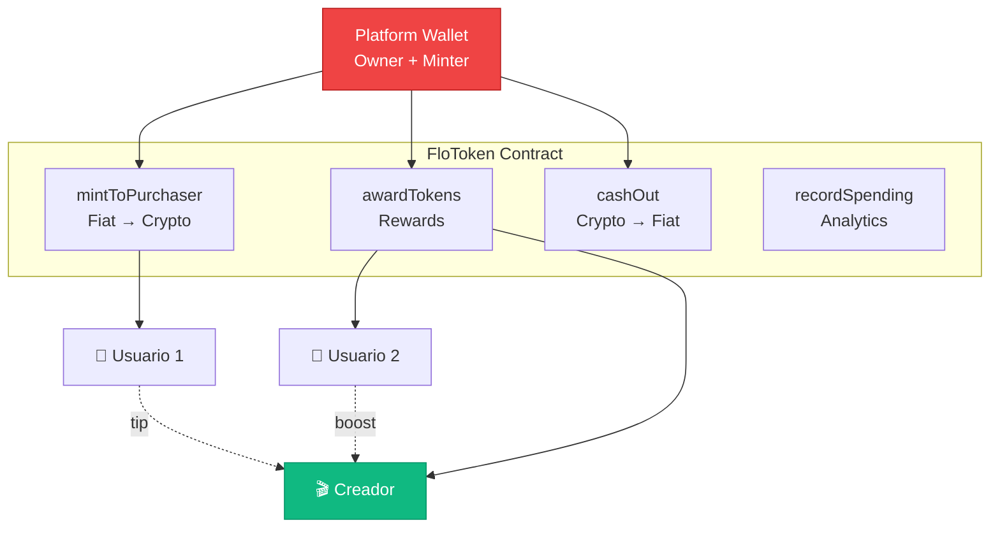
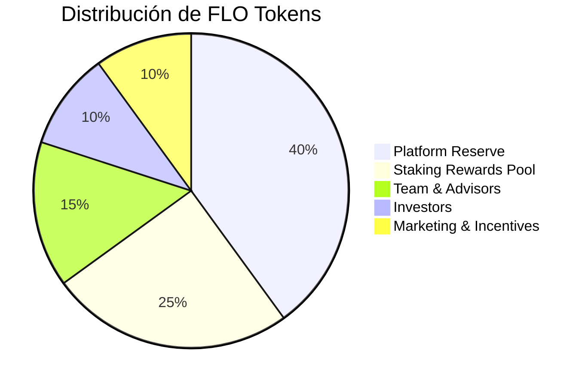
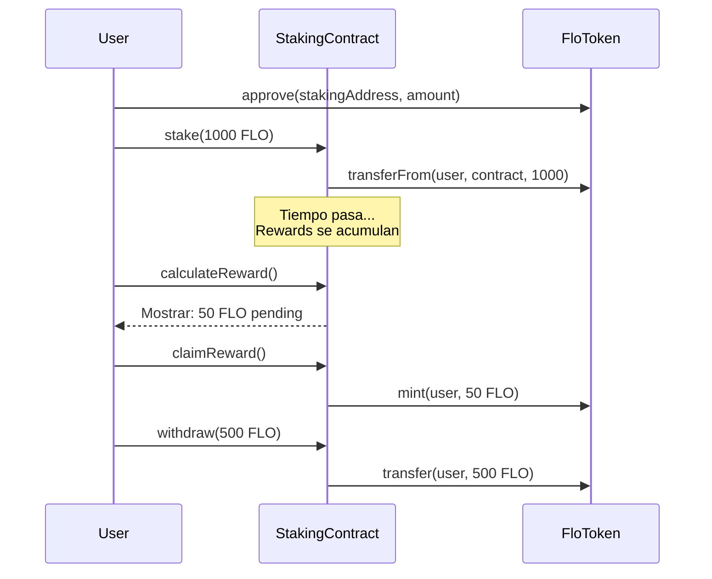
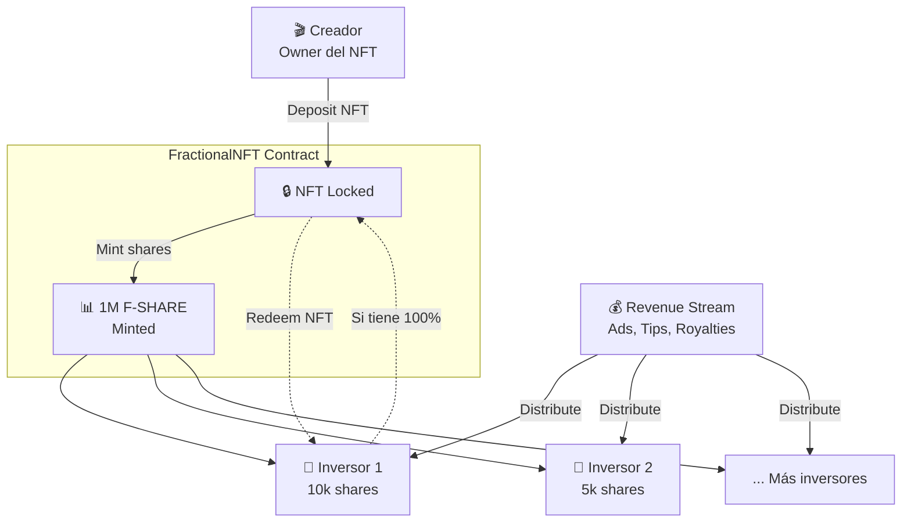
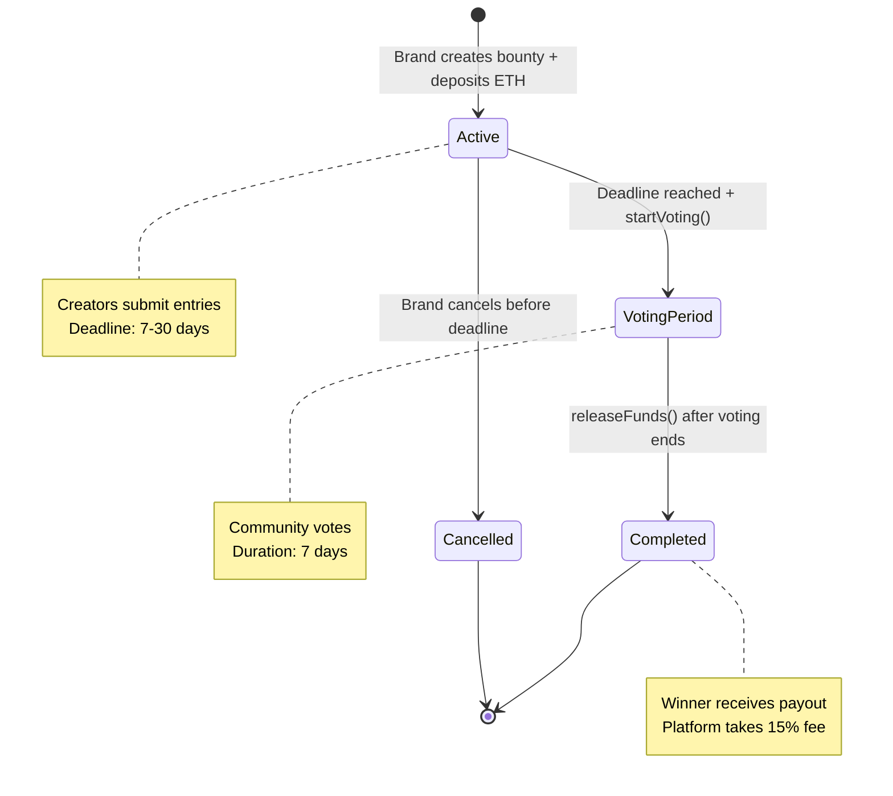

# ⛓️ FlowAI - Smart Contracts Documentation

> **Versión**: 1.1.0  
> **Network**: Polygon (Testnet: Mumbai | Mainnet: TBD)  
> **Solidity**: ^0.8.20  
> **OpenZeppelin**: Latest stable  
> **Última actualización**: 2025-12-08  

---

## 📋 Resumen Ejecutivo

FlowAI implementa una economía de tokens Web3 con 4 contratos inteligentes en Polygon:

| Contrato | Propósito | Estado | Auditoría |
|----------|-----------|--------|-----------|
| **FloToken** | ERC-20 utility token | ✅ Deployed (Testnet) | ⏳ Pendiente |
| **FlowStaking** | Staking con rewards | ✅ Deployed (Testnet) | ⏳ Pendiente |
| **FractionalNFT** | Fraccionalización de NFTs | ✅ Deployed (Testnet) | ⏳ Pendiente |
| **BountyEscrow** | Marketplace de bounties | ✅ Deployed (Testnet) | ⏳ Pendiente |

**⚠️ IMPORTANTE**: Estos contratos están en testnet. **NO deployen a mainnet sin auditoría externa completa.**

---

## 🎯 Tabla de Contenidos

1. [FloToken (ERC-20)](#1-flotoken-erc-20)
2. [FlowStaking](#2-flowstaking)
3. [FractionalNFT](#3-fractionalnft)
4. [BountyEscrow](#4-bountyescrow)
5. [Seguridad y Auditoría](#5-seguridad-y-auditoría)
6. [Deployment Guide](#6-deployment-guide)
7. [Interacción desde Frontend](#7-interacción-desde-frontend)

---

## 1. FloToken (ERC-20)

### 1.1 Especificación

```solidity
contract FloToken is ERC20, Ownable
```

**Token Details**:
- **Name**: FlowAI Token
- **Symbol**: FLO
- **Decimals**: 18 (standard)
- **Initial Supply**: 100,000,000 FLO (100M tokens)
- **Max Supply**: Unlimited (mintable por platform)
- **Network**: Polygon (low gas fees)

### 1.2 Arquitectura



### 1.3 Funciones Principales

#### `mintToPurchaser(address user, uint256 amount, uint256 usdValue)`
**Propósito**: Mintear tokens cuando un usuario compra con fiat (Stripe)

**Flujo**:
1. Usuario paga $10 USD via Stripe
2. Backend recibe webhook de Stripe
3. Backend calcula: `amount = $10 / $0.10 = 100 FLO`
4. Backend llama: `mintToPurchaser(userAddress, 100 * 10^18, 1000)` (1000 cents)
5. Contrato mintea 100 FLO al usuario

**Permisos**: Solo `platform` address puede llamar (modifier `onlyPlatform`)

**Eventos**:
```solidity
event TokensPurchased(address indexed user, uint256 amount, uint256 usdValue);
```

**Seguridad**:
- ✅ Solo platform puede mintear (previene inflación no autorizada)
- ✅ Registro de USD value para accounting
- ❌ **FALTA**: Cap de max supply (riesgo de inflación infinita)

---

#### `awardTokens(address user, uint256 amount, string memory reason)`
**Propósito**: Recompensar usuarios por actividad (Proof of Attention, referrals, etc.)

**Casos de uso**:
```javascript
// Ejemplo: Usuario vio un video completo
awardTokens(userAddress, 5 * 10^18, "Watched video #123");

// Ejemplo: Usuario refirió a un amigo
awardTokens(referrerAddress, 50 * 10^18, "Referral bonus");

// Ejemplo: Creador publicó contenido viral
awardTokens(creatorAddress, 1000 * 10^18, "Viral content milestone");
```

**Tracking**:
- Incrementa `earned[user]` mapping para analytics
- Útil para mostrar en dashboard: "Has ganado 1,250 FLO desde que te uniste"

**Eventos**:
```solidity
event TokensEarned(address indexed user, uint256 amount, string reason);
```

---

#### `cashOut(address user, uint256 amount)`
**Propósito**: Quemar tokens cuando usuario convierte FLO → USD

**Flujo**:
1. Usuario solicita cash-out de 500 FLO
2. Backend verifica balance >= 500 FLO
3. Backend llama `cashOut(userAddress, 500 * 10^18)`
4. Contrato quema los tokens
5. Backend envía $50 USD via Stripe Transfer

**Seguridad**:
- ✅ Requiere balance suficiente
- ✅ Burn permanente (deflacionario)
- ❌ **FALTA**: Cooldown period (prevenir lavado de dinero)
- ❌ **FALTA**: KYC check off-chain antes de permitir

**Eventos**:
```solidity
event TokensCashedOut(address indexed user, uint256 amount);
```

---

#### `recordSpending(address user, uint256 amount, string memory purpose)`
**Propósito**: Analytics de gasto de tokens (no transfiere, solo registra)

**Casos de uso**:
```javascript
// Usuario da tip de 10 FLO a creador
token.transfer(creatorAddress, 10 * 10^18);
token.recordSpending(userAddress, 10 * 10^18, "Tip to creator #456");

// Usuario boostea un clip
token.transfer(platformAddress, 20 * 10^18);
token.recordSpending(userAddress, 20 * 10^18, "Boost clip #789");
```

**Tracking**:
- Incrementa `spent[user]` mapping
- Útil para analytics: "Usuario gastó 2,500 FLO en tips este mes"

---

### 1.4 Variables de Estado

```solidity
address public platform;                          // Address autorizada para mintear
mapping(address => uint256) public earned;        // Total tokens ganados por usuario
mapping(address => uint256) public spent;         // Total tokens gastados por usuario
```

### 1.5 Tokenomics

#### Distribución Inicial (100M FLO)



| Categoría | Tokens | Vesting | Propósito |
|-----------|--------|---------|-----------|
| Platform Reserve | 40M | Ninguno | Mintear para ventas y rewards |
| Staking Rewards | 25M | 48 meses | Distribuir via FlowStaking |
| Team & Advisors | 15M | 24 meses cliff | Compensación equipo |
| Investors (Pre-Seed) | 10M | 12 meses cliff | Seed funding $750k |
| Marketing | 10M | 12 meses | Airdrops, campañas |

#### Precio y Valoración

| Métrica | Valor | Notas |
|---------|-------|-------|
| **Precio inicial** | $0.10 USD | 1 FLO = 10 cents |
| **FDV (Fully Diluted)** | $10M | 100M tokens × $0.10 |
| **Market Cap inicial** | $4M | 40M circulante × $0.10 |
| **Circulación Year 1** | 40M - 60M | Depende de rewards distribuidos |

#### Supply Economics

**Inflacionario vs Deflacionario**:
- **Minteo** (inflacionario): Compras fiat + Rewards
- **Quema** (deflacionario): Cash-outs

**Ejemplo Year 1**:
```
Supply inicial:    100,000,000 FLO
+ Compras:          +5,000,000 FLO (usuarios comprando)
+ Rewards:          +8,000,000 FLO (PoA + referrals)
- Cash-outs:        -3,000,000 FLO (usuarios retirando)
= Supply final:    110,000,000 FLO (+10% inflación)
```

**⚠️ Riesgo**: Sin cap de supply, inflación puede descontrolar valor del token.

---

### 1.6 Seguridad y Vulnerabilidades

#### ✅ Protecciones Implementadas

| Protección | Descripción |
|------------|-------------|
| **onlyPlatform modifier** | Solo platform address puede mintear/quemar |
| **Ownable** | Solo owner puede cambiar platform address |
| **OpenZeppelin ERC20** | Implementación battle-tested |
| **Emit Events** | Todas las acciones críticas logueadas |

#### ❌ Vulnerabilidades Conocidas

| Vulnerabilidad | Severidad | Mitigación Recomendada |
|----------------|-----------|------------------------|
| **Inflación infinita** | 🔴 Alta | Implementar max supply cap |
| **No KYC enforcement** | 🟠 Media | Integrar Chainalysis/KYC off-chain |
| **Centralización (single platform key)** | 🟠 Media | Multi-sig wallet (Gnosis Safe) |
| **No pausable** | 🟡 Baja | Heredar de `Pausable` para emergencias |
| **No blacklist** | 🟡 Baja | Añadir blacklist para addresses maliciosos |

#### Recomendaciones Pre-Mainnet

1. **Auditoría Externa**: Contratar CertiK, Quantstamp o OpenZeppelin Audit (~$15k)
2. **Max Supply**: Implementar cap de 1B tokens
3. **Multi-sig**: Usar Gnosis Safe con 3-of-5 signers para platform address
4. **Emergency Pause**: Añadir `Pausable` para freezar en caso de exploit
5. **Time-lock**: Implementar timelock de 48h para cambios críticos (ownership)

---

## 2. FlowStaking

### 2.1 Especificación

```solidity
contract FlowStaking is ReentrancyGuard, Ownable
```

**Propósito**: Permitir a holders de FLO hacer staking y ganar rewards pasivos

**Características**:
- Staking flexible (stake/unstake cuando quieras)
- Rewards calculados por segundo
- Auto-compounding opcional

### 2.2 Arquitectura



### 2.3 Fórmula de Rewards

```solidity
reward = (stakedAmount * secondsStaked * REWARD_RATE) / REWARD_DIVISOR

// Constantes:
REWARD_RATE = 1
REWARD_DIVISOR = 1000

// Ejemplo:
// User staked: 1,000 FLO
// Time: 86,400 seconds (1 día)
// Reward = (1000 * 86400 * 1) / 1000 = 86.4 FLO/día

// APY aproximado = (86.4 / 1000) * 365 = 31.5% APY
```

### 2.4 Funciones Principales

#### `stake(uint256 amount)`
**Flujo**:
1. Usuario aprueba contrato para gastar FLO
2. Usuario llama `stake(amount)`
3. Contrato transfiere FLO de usuario a contrato
4. Actualiza `stakes[user]` con amount y timestamp

**Seguridad**:
- ✅ ReentrancyGuard previene ataques de re-entrada
- ✅ Requiere approval previa
- ❌ **FALTA**: Minimum stake amount (prevenir spam)

#### `withdraw(uint256 amount)`
**Flujo**:
1. Usuario llama `withdraw(amount)`
2. Contrato auto-claims rewards pendientes
3. Reduce stake y transfiere FLO de vuelta a usuario

**Seguridad**:
- ✅ Verifica balance suficiente
- ✅ Auto-claim previene pérdida de rewards
- ❌ **FALTA**: Withdrawal cooldown (prevenir gaming)

#### `claimReward()`
**Flujo**:
1. Usuario llama `claimReward()`
2. Contrato calcula rewards desde último claim
3. Mintea nuevos FLO como reward
4. Resetea timestamp

**⚠️ CRÍTICO**: Contrato necesita permiso `MINTER_ROLE` en FloToken, pero FloToken actual no tiene AccessControl.

**Fix requerido**:
```solidity
// En FloToken.sol, añadir:
function mint(address to, uint256 amount) external onlyPlatform {
    _mint(to, amount);
}

// Y dar role a FlowStaking:
floToken.updatePlatform(stakingContractAddress);
```

### 2.5 APY Calculation

```javascript
// APY dinámico basado en Total Value Locked (TVL)
const ANNUAL_REWARD_POOL = 25_000_000; // 25M FLO reserved

function calculateAPY(tvl) {
  return (ANNUAL_REWARD_POOL / tvl) * 100;
}

// Ejemplos:
// TVL = 10M FLO → APY = 250% (muy alto, early adopters)
// TVL = 25M FLO → APY = 100%
// TVL = 50M FLO → APY = 50%
```

### 2.6 Vulnerabilidades

| Vulnerabilidad | Severidad | Mitigación |
|----------------|-----------|------------|
| **Contrato no tiene MINTER_ROLE** | 🔴 Crítico | Dar permiso o redesign |
| **No minimum stake** | 🟡 Bajo | Require stake >= 10 FLO |
| **No emergency withdraw** | 🟠 Medio | Añadir `emergencyWithdraw()` |
| **Reward calculation overflow** | 🟢 Muy Bajo | OpenZeppelin SafeMath automático en 0.8+ |

---

## 3. FractionalNFT

### 3.1 Especificación

```solidity
contract FractionalNFT is ERC20, ERC721Holder, Ownable
```

**Propósito**: Fraccionalizar NFTs virales para que múltiples inversores participen en royalties

**Use Case**: 
- Creador mintea video viral como NFT
- Fraccionaliza en 1,000,000 shares (F-SHARE tokens)
- Inversores compran shares
- Cuando el video genera ingresos (ads, tips), se distribuyen a shareholders

### 3.2 Arquitectura



### 3.3 Funciones Principales

#### `initialize(address nftContract, uint256 nftId, uint256 supply)`
**Flujo**:
1. Creador aprueba NFT al contrato
2. Owner llama `initialize(nftAddress, tokenId, 1_000_000)`
3. Contrato transfiere NFT a sí mismo (lockeo)
4. Contrato mintea 1M F-SHARE tokens al owner
5. Owner vende shares en OpenSea o DEX

**Seguridad**:
- ✅ Solo owner puede inicializar
- ✅ Solo puede inicializarse una vez (`initialized` flag)
- ❌ **FALTA**: Verificar que NFT existe antes de transfer

#### `receive() / distributeDividends()`
**Flujo**:
1. Platform envía revenue al contrato: `contract.transfer(1 ETH)`
2. Contrato incrementa `totalDividends`
3. Shareholders pueden calcular su parte: `(balance / totalSupply) * totalDividends`

**⚠️ PROBLEMA**: Dividend tracking es extremadamente simplificado. No implementa:
- Claim individual por holder
- Tracking de dividends ya reclamados
- Prevención de doble-claim

**Fix requerido**: Implementar [Scalable Reward Distribution Algorithm](https://uploads-ssl.webflow.com/5ad71ffeb79acc67c8bcdaba/5ad8d1193a40977462982470_scalable-reward-distribution-paper.pdf)

```solidity
// Implementación sugerida:
mapping(address => uint256) public claimedDividends;
uint256 public totalDividendsPerShare;

function distributeDividends() public payable {
    totalDividendsPerShare += (msg.value * 1e18) / totalSupply();
}

function claimDividends() external {
    uint256 owed = (balanceOf(msg.sender) * totalDividendsPerShare / 1e18) 
                   - claimedDividends[msg.sender];
    claimedDividends[msg.sender] += owed;
    payable(msg.sender).transfer(owed);
}
```

#### `redeem()`
**Propósito**: Si un holder acumula 100% de shares, puede canjear el NFT original

**Flujo**:
1. Holder compra todas las shares del mercado
2. Holder llama `redeem()`
3. Contrato verifica `balanceOf(holder) == totalSupply()`
4. Contrato quema todas las shares
5. Contrato transfiere NFT de vuelta al holder

**Use Case**: "Acquisition" del NFT viral por un coleccionista o marca

### 3.4 Vulnerabilidades

| Vulnerabilidad | Severidad | Mitigación |
|----------------|-----------|------------|
| **Dividend tracking roto** | 🔴 Crítico | Implementar Scalable Reward algorithm |
| **No fee on trades** | 🟡 Bajo | Añadir 1% fee en `transfer()` |
| **No governance** | 🟠 Medio | Permitir voting on-chain con shares |
| **Centralized initialize** | 🟡 Bajo | Permitir que cualquier NFT owner inicialice |

---

## 4. BountyEscrow

### 4.1 Especificación

```solidity
contract BountyEscrow is ReentrancyGuard, Ownable
```

**Propósito**: Marketplace descentralizado donde brands publican bounties y creadores compiten

**Flujo completo**:
1. **Brand crea bounty**: "Necesito 10 videos sobre nuestro producto. Premio: 5 ETH"
2. **Creadores submitean**: Múltiples creadores envían sus videos
3. **Community vota**: Usuarios de FlowAI votan por mejor video
4. **Winner gets paid**: Contrato libera automáticamente el pago al ganador

### 4.2 State Machine



### 4.3 Funciones Principales

#### `createBounty(bytes32 bountyId, uint256 deadline, string requirements)`
**Parámetros**:
- `bountyId`: Hash único (keccak256 de título o random)
- `deadline`: Unix timestamp (ej: `block.timestamp + 14 days`)
- `requirements`: IPFS hash del brief detallado

**Flujo**:
1. Brand llama función con `value: 5 ETH`
2. ETH queda en escrow en el contrato
3. Bounty entra en estado `Active`

**Ejemplo**:
```javascript
const bountyId = ethers.utils.keccak256(ethers.utils.toUtf8Bytes("Nike Sneaker Promo"));
const deadline = Math.floor(Date.now() / 1000) + (14 * 24 * 60 * 60); // 14 días
const requirements = "ipfs://QmX..."; // Brief subido a IPFS

await bountyContract.createBounty(bountyId, deadline, requirements, {
  value: ethers.utils.parseEther("5.0") // 5 ETH
});
```

**Seguridad**:
- ✅ Requiere ETH > 0
- ✅ Previene duplicación de bountyId
- ❌ **FALTA**: Minimum bounty amount (prevenir spam)
- ❌ **FALTA**: Maximum bounty duration (prevenir lock infinito)

---

#### `submitEntry(bytes32 bountyId, string videoUrl)`
**Parámetros**:
- `bountyId`: ID del bounty al que se submitea
- `videoUrl`: IPFS hash o URL del video

**Flujo**:
1. Creador llama función (no requiere ETH)
2. Contrato genera `entryId` único
3. Entry se añade al array `bountyEntries[bountyId]`

**Límites**:
- Deadline no debe haber pasado
- Bounty debe estar en estado `Active`
- Un creador puede submitear múltiples entries (competir contra sí mismo)

**Ejemplo**:
```javascript
await bountyContract.submitEntry(
  bountyId,
  "ipfs://QmY..." // Video subido a IPFS
);
```

---

#### `startVoting(bytes32 bountyId)`
**Cuándo**: Después de que `deadline` ha pasado

**Flujo**:
1. Cualquiera puede llamar (permissionless)
2. Contrato verifica que deadline pasó y hay entries
3. Estado cambia a `VotingPeriod`
4. `votingEndTime = block.timestamp + 7 days`

**Seguridad**:
- ✅ Permissionless (no depende del brand)
- ❌ **FALTA**: Incentivo para quien llame (gas refund o reward)

---

#### `vote(bytes32 bountyId, uint256 entryIndex)`
**Flujo**:
1. Usuario llama con índice de su entry favorita
2. Contrato verifica que no haya votado antes
3. Incrementa `voteCount` de la entry
4. Marca usuario en `hasVoted[bountyId][user]`

**Limitaciones**:
- Un voto por usuario por bounty
- Solo durante voting period
- No hay peso de voto (1 wallet = 1 voto)

**⚠️ VULNERABILIDAD: Sybil Attack**
- Un atacante puede crear 100 wallets y votar 100 veces por su propia entry
- **Mitigación recomendada**: 
  - Requiere stake mínimo de FLO tokens para votar
  - O usar sistema de quadratic voting
  - O votos ponderados por FLO balance

---

#### `releaseFunds(bytes32 bountyId)`
**Cuándo**: Después de que `votingEndTime` ha pasado

**Flujo**:
1. Cualquiera puede llamar (permissionless)
2. Contrato itera sobre todas las entries
3. Encuentra entry con más votos
4. Calcula: `platformFee = amount * 15%`
5. Transfiere `platformFee` a `platformWallet`
6. Transfiere resto al creador ganador

**Seguridad**:
- ✅ ReentrancyGuard previene ataques
- ✅ Estado cambia a `Completed` antes de transfers
- ❌ **FALTA**: Tie-breaker logic (qué pasa si empate)

**Ejemplo de Payout**:
```
Bounty Amount: 5 ETH
Platform Fee:  0.75 ETH (15%)
Creator Gets:  4.25 ETH (85%)
```

---

#### `cancelBounty(bytes32 bountyId)`
**Propósito**: Permitir al brand cancelar si no hay entries suficientes

**Restricciones**:
- Solo brand que creó el bounty puede cancelar
- Solo antes de deadline
- Solo si está en estado `Active`

**Flujo**:
1. Brand llama `cancelBounty()`
2. ETH se refunda 100% al brand
3. Estado cambia a `Cancelled`

**Protección de Creadores**:
- Si deadline ya pasó, no se puede cancelar
- Protege creadores que invirtieron tiempo

---

### 4.4 Economics

#### Platform Fee Model

| Bounty Amount | Platform Fee (15%) | Creator Payout (85%) |
|---------------|-------------------|----------------------|
| 1 ETH | 0.15 ETH | 0.85 ETH |
| 5 ETH | 0.75 ETH | 4.25 ETH |
| 10 ETH | 1.5 ETH | 8.5 ETH |

**Fee Comparison**:
- FlowAI: 15%
- Fiverr: 20%
- Upwork: 10-20%
- Traditional agencies: 30-50%

#### Revenue Projection

```
Year 1 Target:
- 100 bounties/month
- Average bounty: 2 ETH
- Monthly volume: 200 ETH
- Platform revenue: 30 ETH/month (15%)
- At $2000/ETH = $60k MRR from bounties alone
```

### 4.5 Vulnerabilidades

| Vulnerabilidad | Severidad | Mitigación |
|----------------|-----------|------------|
| **Sybil attacks en voting** | 🔴 Crítico | Require FLO stake para votar |
| **No tie-breaker** | 🟠 Medio | Implementar timestamp tiebreak |
| **Gas costs para iterar entries** | 🟠 Medio | Limit max entries por bounty |
| **Brand puede crear bounty fake** | 🟡 Bajo | Require minimum brand reputation |
| **No dispute resolution** | 🟡 Bajo | Añadir arbitration system |

---

## 5. Seguridad y Auditoría

### 5.1 Estado Actual de Auditoría

| Contrato | Líneas | Complejidad | Auto-Audit | Ext. Audit | Status |
|----------|--------|-------------|------------|------------|--------|
| FloToken | 128 | Baja | ✅ Pass | ⏳ Pendiente | Testnet |
| FlowStaking | 79 | Media | ⚠️ Issue: mint() | ⏳ Pendiente | Testnet |
| FractionalNFT | 51 | Alta | ❌ Fail: dividends | ⏳ Pendiente | Testnet |
| BountyEscrow | 228 | Alta | ⚠️ Issue: Sybil | ⏳ Pendiente | Testnet |

### 5.2 Issues Críticos Pre-Mainnet

#### 🔴 P0 - CRÍTICO (Blocker para mainnet)

1. **FlowStaking: No MINTER_ROLE**
   - **Problema**: `claimReward()` llama `floToken.mint()` pero FloToken no tiene esa función
   - **Fix**: Añadir `mint()` a FloToken con `onlyPlatform` modifier
   - **ETA**: 2 horas

2. **FractionalNFT: Dividend tracking roto**
   - **Problema**: Holders pueden claim infinitamente
   - **Fix**: Implementar Scalable Reward algorithm
   - **ETA**: 1 día

3. **BountyEscrow: Sybil attack en voting**
   - **Problema**: Attackers crean 1000 wallets y votan por sí mismos
   - **Fix**: Require FLO stake >= 100 tokens para votar
   - **ETA**: 4 horas

#### 🟠 P1 - ALTA (Importante pero no blocker)

4. **FloToken: Inflación infinita**
   - **Problema**: Sin max supply cap
   - **Fix**: Añadir `MAX_SUPPLY = 1_000_000_000` (1B)
   - **ETA**: 2 horas

5. **Todos los contratos: No Pausable**
   - **Problema**: Si hay exploit, no hay forma de detener
   - **Fix**: Heredar de OpenZeppelin `Pausable`
   - **ETA**: 4 horas

6. **FloToken: Single platform address**
   - **Problema**: Si private key se compromete, game over
   - **Fix**: Usar Gnosis Safe multi-sig (3-of-5)
   - **ETA**: Setup: 1 día

### 5.3 Security Best Practices

#### ✅ Implementado

- ✅ OpenZeppelin imports (battle-tested)
- ✅ ReentrancyGuard en funciones críticas
- ✅ Ownable para funciones admin
- ✅ Events para todas las acciones importantes
- ✅ Require statements con mensajes claros

#### ❌ Falta Implementar

- ❌ Access Control Roles (MINTER_ROLE, PAUSER_ROLE, etc.)
- ❌ Pausable para emergencias
- ❌ TimeLock para cambios de ownership
- ❌ Multi-sig para platform address
- ❌ Max caps (supply, bounty duration, etc.)
- ❌ Rate limiting (submits por usuario)

### 5.4 Recomendaciones de Auditoría

#### Auditoría Externa ($15k - $50k)

**Proveedores recomendados**:
1. **OpenZeppelin Audit** (~$50k, gold standard)
2. **CertiK** (~$30k, especialistas en DeFi)
3. **Quantstamp** (~$25k, buenos reports)
4. **Trail of Bits** (~$40k, muy técnicos)
5. **Consensys Diligence** (~$35k, experiencia en tokens)

**Scope recomendado**:
- Full audit de los 4 contratos
- Gas optimization review
- Economic modeling review
- Timeframe: 2-4 semanas

#### Bug Bounty Program ($10k - $50k reserve)

**Plataformas**:
- Immunefi (líder en Web3)
- HackerOne
- Code4rena (competitive audits)

**Rewards**:
- 🔴 Critical: $10k - $50k
- 🟠 High: $2k - $10k
- 🟡 Medium: $500 - $2k
- 🟢 Low: $100 - $500

---

## 6. Deployment Guide

### 6.1 Pre-Deployment Checklist

- [ ] Todos los P0 issues resueltos
- [ ] Auditoría externa completada
- [ ] Tests: >90% coverage
- [ ] Gas optimization completado
- [ ] Multi-sig wallet configurado
- [ ] Monitoring setup (Tenderly/Defender)
- [ ] Emergency playbook documentado

### 6.2 Deployment Steps (Polygon Mainnet)

#### Step 1: Setup Environment

```bash
cd contracts
npm install

# Create .env
cp .env.example .env
# Editar .env:
# POLYGON_RPC_URL=https://polygon-rpc.com
# DEPLOYER_PRIVATE_KEY=0x...
# POLYGONSCAN_API_KEY=...
```

#### Step 2: Deploy FloToken

```bash
npx hardhat run scripts/deploy.js --network polygon

# Output:
# FloToken deployed to: 0xABC123...
```

#### Step 3: Transfer Ownership to Multi-sig

```javascript
// En Gnosis Safe UI:
1. Crear Safe con 5 signers (3-of-5)
2. En smart contract, llamar:
   floToken.transferOwnership(gnosisSafeAddress)
3. Requiere 3 confirmaciones
```

#### Step 4: Deploy Staking

```bash
npx hardhat run scripts/deploy-staking.js --network polygon

# En el script:
const stakingContract = await FlowStaking.deploy(floTokenAddress);
```

#### Step 5: Grant Minting Permissions

```javascript
// Via Gnosis Safe (3 confirmaciones requeridas):
await floToken.updatePlatform(stakingContractAddress);
```

#### Step 6: Deploy FractionalNFT & BountyEscrow

```bash
npx hardhat run scripts/deploy-all.js --network polygon
```

#### Step 7: Verify on PolygonScan

```bash
npx hardhat verify --network polygon 0xABC123... "Constructor Args"
```

### 6.3 Post-Deployment

#### Monitoring Setup

```javascript
// Tenderly setup
tenderly.monitor({
  contract: floTokenAddress,
  alerts: [
    { event: "TokensPurchased", webhook: "..." },
    { event: "TokensCashedOut", threshold: "> 10000 FLO" }
  ]
});
```

#### Initial Liquidity

```
1. Añadir liquidez a Quickswap (Polygon DEX):
   - 1M FLO + 100k USDC
   - Crear pool FLO/USDC
   
2. Set initial price: $0.10 per FLO
```

---

## 7. Interacción desde Frontend

### 7.1 Setup Wagmi + RainbowKit

```typescript
// src/lib/wagmi-config.ts
import { getDefaultConfig } from '@rainbow-me/rainbowkit';
import { polygon, polygonMumbai } from 'wagmi/chains';

export const config = getDefaultConfig({
  appName: 'FlowAI',
  projectId: 'YOUR_WALLETCONNECT_ID',
  chains: [polygon, polygonMumbai],
});
```

### 7.2 Contract ABIs

```typescript
// src/lib/contracts.ts
export const FLO_TOKEN_ADDRESS = "0xABC..."; // Polygon Mainnet
export const STAKING_ADDRESS = "0xDEF...";

export const FLO_TOKEN_ABI = [
  "function balanceOf(address) view returns (uint256)",
  "function transfer(address to, uint256 amount) returns (bool)",
  "function approve(address spender, uint256 amount) returns (bool)",
  "event TokensPurchased(address indexed user, uint256 amount, uint256 usdValue)"
];
```

### 7.3 Ejemplo: Mostrar Balance

```typescript
// src/components/WalletCard.tsx
import { useAccount, useReadContract } from 'wagmi';
import { FLO_TOKEN_ADDRESS, FLO_TOKEN_ABI } from '@/lib/contracts';

export function WalletCard() {
  const { address } = useAccount();
  
  const { data: balance } = useReadContract({
    address: FLO_TOKEN_ADDRESS,
    abi: FLO_TOKEN_ABI,
    functionName: 'balanceOf',
    args: [address],
  });
  
  const floBalance = balance ? Number(balance) / 1e18 : 0;
  
  return (
    <div>
      <h3>Your FLO Balance</h3>
      <p>{floBalance.toFixed(2)} FLO</p>
    </div>
  );
}
```

### 7.4 Ejemplo: Stake Tokens

```typescript
import { useWriteContract, useWaitForTransactionReceipt } from 'wagmi';

export function StakingInterface() {
  const { writeContract, data: hash } = useWriteContract();
  const { isSuccess } = useWaitForTransactionReceipt({ hash });
  
  const handleStake = async (amount: string) => {
    // Step 1: Approve
    await writeContract({
      address: FLO_TOKEN_ADDRESS,
      abi: FLO_TOKEN_ABI,
      functionName: 'approve',
      args: [STAKING_ADDRESS, parseEther(amount)],
    });
    
    // Step 2: Stake (después de approval confirm)
    await writeContract({
      address: STAKING_ADDRESS,
      abi: STAKING_ABI,
      functionName: 'stake',
      args: [parseEther(amount)],
    });
  };
  
  return (
    <button onClick={() => handleStake("100")}>
      Stake 100 FLO
    </button>
  );
}
```

---

## 📚 Referencias

### Documentación Oficial
- [OpenZeppelin Contracts](https://docs.openzeppelin.com/contracts/)
- [Hardhat Documentation](https://hardhat.org/docs)
- [Polygon Documentation](https://docs.polygon.technology/)
- [Wagmi Documentation](https://wagmi.sh/)

### Security Resources
- [Smart Contract Security Best Practices](https://consensys.github.io/smart-contract-best-practices/)
- [Solidity Security Considerations](https://docs.soliditylang.org/en/latest/security-considerations.html)
- [Trail of Bits Security Guide](https://github.com/crytic/building-secure-contracts)

### Auditing
- [CertiK](https://www.certik.com/)
- [Quantstamp](https://quantstamp.com/)
- [OpenZeppelin Audits](https://www.openzeppelin.com/security-audits)

---

## 📝 Changelog

- **2024-XX-XX**: Versión 1.0.0 - Documentación completa de contratos en testnet

---

*Documentación mantenida por Blockchain Lead. Para cambios, abrir PR en `docs/SMART_CONTRACTS.md`.*

**⚠️ DISCLAIMER**: Estos contratos están en testnet. NO usar en mainnet sin auditoría externa completa.
