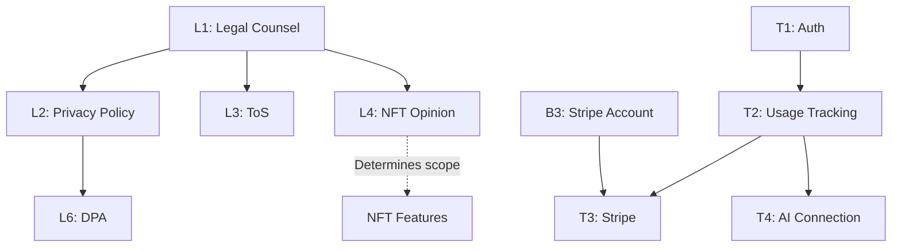

# FlowAI Task Tracker

**Last Updated:** December 2025  
**Sprint Length:** 2 weeks

---

## 🔴 Sprint 1: Foundation (Weeks 1-2)

### Critical Path (Must Complete)

- [ ] **L1** - Hire crypto/NFT legal counsel
  - Owner: CEO
  - Deadline: Week 1
  - Notes: Critical for NFT feature legality
  
- [ ] **L2** - Privacy Policy (GDPR/CCPA compliant)
  - Owner: Legal
  - Deadline: Week 2
  - Blockers: L1
  
- [ ] **L3** - Terms of Service
  - Owner: Legal
  - Deadline: Week 2
  - Blockers: L1

- [ ] **T1** - Complete authentication flow
  - Owner: Dev
  - Deadline: Week 1
  - Status: In Progress
  - Notes: Email + OAuth

- [ ] **T2** - Usage tracking system
  - Owner: Dev
  - Deadline: Week 1
  - Blockers: T1
  - Notes: Track generations per user

- [ ] **T5** - Error monitoring (Sentry)
  - Owner: Dev
  - Deadline: Week 1
  - Notes: Configure VITE_SENTRY_DSN

- [ ] **B1** - Finalize pricing model
  - Owner: CEO
  - Deadline: Week 1
  - Notes: Usage-based tiers confirmed

- [ ] **B3** - Set up Stripe account
  - Owner: CEO
  - Deadline: Week 1

- [ ] **M1** - Landing page optimization
  - Owner: Growth
  - Deadline: Week 1

- [ ] **M2** - Waitlist setup
  - Owner: Growth
  - Deadline: Week 1

- [ ] **M4** - Social media accounts
  - Owner: Growth
  - Deadline: Week 1
  - Channels: Twitter/X, TikTok, Discord

---

## 🟡 Sprint 2: Payments & Legal (Weeks 3-4)

### Payment Integration

- [ ] **T3** - Stripe integration
  - Owner: Dev
  - Deadline: Week 2
  - Blockers: B3, T2
  - Tasks:
    - [ ] Enable Stripe in Lovable
    - [ ] Create subscription products
    - [ ] Implement usage metering
    - [ ] Add billing portal
    - [ ] Webhook handling

- [ ] **T4** - AI generation connection
  - Owner: Dev
  - Deadline: Week 2
  - Blockers: T2
  - Tasks:
    - [ ] Create generate-ai edge function
    - [ ] Connect to Lovable AI
    - [ ] Implement rate limiting
    - [ ] Usage deduction

### Legal Compliance

- [ ] **L5** - Cookie consent implementation
  - Owner: Dev
  - Deadline: Week 2
  - Notes: Required for EU launch

- [ ] **L6** - Data Processing Agreement
  - Owner: Legal
  - Deadline: Week 3
  - Blockers: L2

- [ ] **L7** - DMCA takedown process
  - Owner: Legal
  - Deadline: Week 3

### Marketing

- [ ] **M3** - Content calendar creation
  - Owner: Growth
  - Deadline: Week 2

- [ ] **M6** - Influencer outreach list
  - Owner: Growth
  - Deadline: Week 2
  - Target: 50 creators

- [ ] **M8** - Discord/community setup
  - Owner: Growth
  - Deadline: Week 2

### Operations

- [ ] **O1** - Support documentation
  - Owner: Ops
  - Deadline: Week 2

- [ ] **O2** - FAQ creation
  - Owner: Ops
  - Deadline: Week 2

---

## 🟢 Sprint 3: Polish & Testing (Weeks 5-6)

### Technical

- [ ] **T6** - Rate limiting
  - Owner: Dev
  - Deadline: Week 3
  - Notes: Per-user, per-endpoint limits

- [ ] **T7** - E2E test coverage
  - Owner: Dev
  - Deadline: Week 3
  - Target: 80% coverage

- [ ] **T9** - Mobile responsiveness
  - Owner: Dev
  - Deadline: Week 3
  - Notes: iOS Safari, Android Chrome

### Legal

- [ ] **L4** - NFT legal opinion
  - Owner: Legal
  - Deadline: Week 4
  - Critical: Determines NFT feature scope

- [ ] **L8** - AI disclosure policy
  - Owner: Legal
  - Deadline: Week 4
  - Notes: EU AI Act compliance

### Business

- [ ] **B2** - Create financial model
  - Owner: CEO
  - Deadline: Week 1

- [ ] **B4** - Bank account for business
  - Owner: CEO
  - Deadline: Week 2

- [ ] **B5** - Business entity formation
  - Owner: Legal
  - Deadline: Week 2
  - Notes: LLC or Inc, Delaware recommended

### Marketing

- [ ] **M5** - Press kit preparation
  - Owner: Growth
  - Deadline: Week 3
  - Contents: Logo, screenshots, founder bio

### Operations

- [ ] **O3** - Monitoring dashboards
  - Owner: Dev
  - Deadline: Week 3
  - Metrics: Error rate, latency, usage

---

## 🔵 Sprint 4: Launch Prep (Weeks 7-8)

### Technical

- [ ] **T8** - Performance optimization
  - Owner: Dev
  - Deadline: Week 4
  - Targets:
    - [ ] LCP < 2.5s
    - [ ] FID < 100ms
    - [ ] CLS < 0.1

- [ ] **T10** - User data export feature
  - Owner: Dev
  - Deadline: Week 4
  - Notes: GDPR data portability

### Business

- [ ] **B6** - Insurance (E&O, cyber)
  - Owner: CEO
  - Deadline: Week 4

- [ ] **B7** - Accounting setup
  - Owner: CEO
  - Deadline: Week 4

### Marketing

- [ ] **M7** - Product Hunt preparation
  - Owner: Growth
  - Deadline: Week 4
  - Tasks:
    - [ ] Create maker profile
    - [ ] Prepare tagline
    - [ ] Screenshot assets
    - [ ] First comment draft
    - [ ] Hunter outreach

### Operations

- [ ] **O4** - Incident response plan
  - Owner: Ops
  - Deadline: Week 4

- [ ] **O5** - Backup verification
  - Owner: Dev
  - Deadline: Week 3

---

## 📊 Progress Summary

| Category | Total | Complete | % |
|----------|-------|----------|---|
| Legal | 8 | 0 | 0% |
| Technical | 10 | 0 | 0% |
| Business | 7 | 0 | 0% |
| Marketing | 8 | 0 | 0% |
| Operations | 5 | 0 | 0% |
| **Total** | **38** | **0** | **0%** |

---

## 🚨 Blockers & Dependencies

---

## 📅 Key Milestones

| Milestone | Target Date | Status |
|-----------|-------------|--------|
| Legal counsel engaged | Week 1 | ⬜ |
| Privacy Policy live | Week 2 | ⬜ |
| Payments functional | Week 3 | ⬜ |
| AI generation live | Week 3 | ⬜ |
| Beta launch | Week 6 | ⬜ |
| Product Hunt launch | Week 8 | ⬜ |

---

## 📝 Meeting Notes

### Kickoff Meeting - [DATE]
- Attendees:
- Decisions:
- Action items:

---

*Update this document weekly during sprint planning.*
