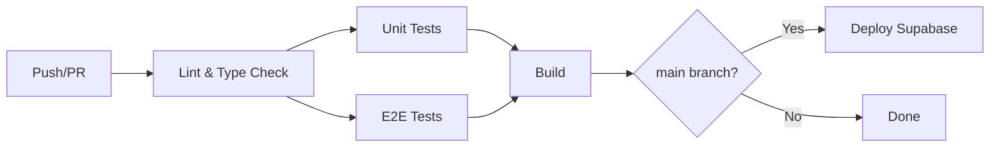

# 🧪 FlowAI Testing Strategy

> **Last Updated**: 2025-12-08  
> **Coverage Target**: 70%

---

## 🏗️ Testing Architecture

| Layer | Tool | Location |
|-------|------|----------|
| **Unit** | Vitest | `src/**/*.test.ts` |
| **Integration** | Vitest + MSW | `src/**/*.test.ts` |
| **E2E** | Playwright | `e2e/*.spec.ts` |
| **Load** | k6 | `tests/load/*.js` |

---

## 📦 NPM Scripts

```bash
npm run test          # Run Vitest in watch mode
npm run test:coverage # Run with coverage report
npm run test:e2e      # Run Playwright tests
npm run test:load     # Run k6 load tests
npm run type-check    # TypeScript validation
```

---

## 🔄 CI/CD Pipeline (`.github/workflows/ci.yml`)



**Triggers**: Push to `main`/`develop`, PRs to `main`

---

## 🔐 GitHub Secrets Required

| Secret | Description |
|--------|-------------|
| `SUPABASE_ACCESS_TOKEN` | CLI token for deployments |
| `SUPABASE_PROJECT_ID` | Project reference ID |
| `VITE_SUPABASE_URL` | Supabase instance URL |
| `VITE_SUPABASE_ANON_KEY` | Anon/public key |
| `CODECOV_TOKEN` | (Optional) Codecov integration |

---

## 📝 Writing Tests

### Unit Test Example
```typescript
import { describe, it, expect } from 'vitest';

describe('MyFunction', () => {
  it('should work', () => {
    expect(myFunction(1, 2)).toBe(3);
  });
});
```

### E2E Test Example
```typescript
import { test, expect } from '@playwright/test';

test('user can login', async ({ page }) => {
  await page.goto('/auth');
  await page.fill('[name="email"]', 'test@example.com');
  await page.click('button[type="submit"]');
  await expect(page).toHaveURL('/dashboard');
});
```

---

## 📊 Coverage Thresholds

- **Branches**: 70%
- **Functions**: 70%
- **Lines**: 70%
- **Statements**: 70%

Configured in `vitest.config.ts`.
