# 🎬 AI Video Editor Pro - Technical Documentation

> **Feature**: AI Video Editor Pro (Remotion)  
> **Version**: 1.0.0  
> **Last Updated**: 2025-12-08  
> **Status**: ✅ Implemented

---

## Overview

FlowAI's AI Video Editor Pro is a professional-grade video editing suite built with Remotion. It provides a timeline-based editing experience with multi-track support, real-time preview, and cloud rendering via AWS Lambda for high-quality video exports.

---

## Architecture

```mermaid
sequenceDiagram
    participant User as 👤 User
    participant Editor as 🖥️ VideoEditorPro.tsx
    participant DB as 🗄️ PostgreSQL
    participant EdgeFn as ⚡ render-video
    participant Lambda as ☁️ AWS Lambda
    participant S3 as 📦 S3 Storage

    User->>Editor: Edit timeline
    Editor->>DB: Save project + tracks + clips
    User->>Editor: Click Export
    Editor->>EdgeFn: POST /render-video
    EdgeFn->>Lambda: Invoke Remotion render
    Lambda->>Lambda: Parallel chunk rendering
    Lambda->>S3: Upload video
    S3-->>User: Download link
```



---

## Database Schema

### Tables

#### `video_projects`
Main table for video editing projects.

| Column | Type | Description |
|--------|------|-------------|
| id | UUID | Primary key |
| user_id | UUID | FK to auth.users |
| name | TEXT | Project name |
| width | INTEGER | Video width (default: 1920) |
| height | INTEGER | Video height (default: 1080) |
| fps | INTEGER | Framerate (default: 30) |
| duration_frames | INTEGER | Total duration in frames |
| composition_data | JSONB | Serialized Remotion composition |
| render_status | TEXT | draft, queued, rendering, completed, failed |
| render_progress | INTEGER | 0-100 percentage |
| rendered_video_url | TEXT | Final video URL |

#### `video_tracks`
Timeline tracks for organizing clips.

| Column | Type | Description |
|--------|------|-------------|
| id | UUID | Primary key |
| project_id | UUID | FK to video_projects |
| track_type | TEXT | video, audio, text, image, shape, effect |
| name | TEXT | Track display name |
| order_index | INTEGER | Vertical position |
| is_locked | BOOLEAN | Prevent edits |
| is_visible | BOOLEAN | Show/hide |
| is_muted | BOOLEAN | Audio mute |

#### `video_clips`
Individual clips on tracks.

| Column | Type | Description |
|--------|------|-------------|
| id | UUID | Primary key |
| track_id | UUID | FK to video_tracks |
| clip_type | TEXT | video, audio, text, image, ai_generated, voice_over |
| start_frame | INTEGER | Timeline start position |
| end_frame | INTEGER | Timeline end position |
| source_url | TEXT | Media source URL |
| position_x/y | NUMERIC | Canvas position |
| scale_x/y | NUMERIC | Transform scale |
| rotation | NUMERIC | Rotation degrees |
| effects | JSONB | Applied effects |
| text_content | TEXT | For text clips |
| volume | NUMERIC | For audio clips |

#### `video_keyframes`
Animation keyframes for smooth transitions.

| Column | Type | Description |
|--------|------|-------------|
| id | UUID | Primary key |
| clip_id | UUID | FK to video_clips |
| frame | INTEGER | Keyframe position |
| property | TEXT | Animated property |
| value | NUMERIC | Value at keyframe |
| easing | TEXT | Easing function |

#### `video_templates`
Pre-built templates for quick starts.

| Column | Type | Description |
|--------|------|-------------|
| id | UUID | Primary key |
| name | TEXT | Template name |
| category | TEXT | social, youtube, tiktok, etc. |
| template_data | JSONB | Full project structure |
| is_premium | BOOLEAN | Paid template |
| price_cents | INTEGER | Template price |

#### `render_queue`
Background rendering job queue.

| Column | Type | Description |
|--------|------|-------------|
| id | UUID | Primary key |
| project_id | UUID | FK to video_projects |
| output_quality | TEXT | draft, medium, high, ultra |
| status | TEXT | pending, processing, completed, failed |
| progress | INTEGER | 0-100 |
| output_url | TEXT | Rendered video URL |

---

## API Reference

### Render Video

**Endpoint**: `POST /functions/v1/render-video`  
**Auth**: Required (Bearer token)

#### Request
```json
{
  "project_id": "uuid",
  "quality": "high",
  "format": "mp4"
}
```

#### Response (200 OK)
```json
{
  "success": true,
  "render_id": "uuid",
  "status": "queued",
  "message": "Render job added to queue"
}
```

#### Quality Limits by Plan

| Quality | Requirements | Resolution |
|---------|--------------|------------|
| draft | Free | 720p |
| medium | PRO+ | 1080p |
| high | PRO+ | 1080p 60fps |
| ultra | BUSINESS+ | 4K |

---

## Frontend Component

### VideoEditorPro.tsx

Location: `src/pages/VideoEditorPro.tsx`

#### Features
- **Timeline Editing**: Multi-track timeline with drag & drop
- **Preview Canvas**: Real-time preview with playback controls
- **Asset Panel**: Upload media, add text, AI generation
- **Properties Panel**: Edit clip transforms, effects, styles
- **Keyframe Animation**: Animate any property over time
- **Cloud Rendering**: Export via AWS Lambda

#### UI Layout
```
┌─────────────────────────────────────────────────────────┐
│ Header (Project name, Save, Export)                      │
├──────────┬─────────────────────────────────┬────────────┤
│          │                                  │            │
│  Assets  │         Preview Canvas          │ Properties │
│  Panel   │                                  │   Panel    │
│          ├─────────────────────────────────┤            │
│          │      Playback Controls          │            │
├──────────┴─────────────────────────────────┴────────────┤
│                        Timeline                          │
│  [Track 1] ███████░░░░░░░████████░░░░░░░░░░░░           │
│  [Track 2] ░░░░░░░░███████████░░░░░░░░░░░░░░           │
│  [Track 3] ░░░░░████░░░░░░░░░░░░░░░███░░░░░░           │
└─────────────────────────────────────────────────────────┘
```

---

## Remotion Integration

### Local Development
```bash
# Install Remotion dependencies
npm install @remotion/cli @remotion/player @remotion/bundler

# Start Remotion Studio
npx remotion studio
```

### AWS Lambda Rendering

#### Prerequisites
1. AWS Account with Lambda access
2. IAM role with Remotion permissions
3. S3 bucket for renders

#### Environment Variables
```bash
AWS_ACCESS_KEY_ID=AKIA...
AWS_SECRET_ACCESS_KEY=...
AWS_REGION=us-east-1
REMOTION_SERVE_URL=https://your-remotion-site.s3.amazonaws.com
```

#### Deploy Remotion Lambda
```bash
npx remotion lambda functions deploy --memory=3009
npx remotion lambda sites create --site-name=flowai-editor
```

---

## Subscription Tiers

| Feature | Free | PRO | BUSINESS |
|---------|------|-----|----------|
| Projects | 3 | Unlimited | Unlimited |
| Max Duration | 1 min | 30 min | 2 hours |
| Export Quality | 720p | 1080p 60fps | 4K |
| Render Priority | Low | Normal | High |
| Templates | Basic | All | All + Custom |
| Cloud Storage | 1 GB | 50 GB | 500 GB |
| AI Generation | ❌ | ✅ | ✅ |

---

## Files Created

| File | Purpose |
|------|---------|
| `supabase/migrations/20251208170200_video_editor_pro.sql` | Database schema |
| `supabase/functions/render-video/index.ts` | Render trigger endpoint |
| `src/pages/VideoEditorPro.tsx` | React UI component |
| `docs/VIDEO_EDITOR_PRO.md` | This documentation |

---

## Deployment Steps

1. **Run database migration**:
   ```bash
   npx supabase db push
   ```

2. **Deploy Edge Function**:
   ```bash
   npx supabase functions deploy render-video
   ```

3. **Set AWS secrets** (for Lambda rendering):
   ```bash
   # In Supabase Dashboard → Edge Functions → Secrets
   AWS_ACCESS_KEY_ID
   AWS_SECRET_ACCESS_KEY
   AWS_REGION
   REMOTION_SERVE_URL
   ```

4. **Install Remotion Lambda** (optional, for production):
   ```bash
   npx remotion lambda functions deploy
   npx remotion lambda sites create
   ```

---

## Helper Functions

### `get_full_project(project_id)`
Returns complete project with all tracks, clips, and keyframes as nested JSON.

### `queue_render(project_id, quality, format)`
Adds a render job to the queue and updates project status.

---

## Future Enhancements

- [ ] Real-time collaboration
- [ ] AI-powered auto-editing
- [ ] Audio waveform visualization
- [ ] Stock media library integration
- [ ] Green screen/chroma key
- [ ] Motion tracking
- [ ] Audio ducking

---

## Version History

| Version | Date | Changes |
|---------|------|---------|
| 1.0.0 | 2025-12-08 | Initial implementation |
