# 🎙️ AI Voice Cloning - Technical Documentation

> **Feature**: AI Voice Cloning & Audio Studio  
> **Version**: 1.0.0  
> **Last Updated**: 2025-12-08  
> **Status**: ✅ Implemented

---

## Overview

FlowAI's Voice Cloning feature allows PRO+ subscribers to clone their voice using AI and generate unlimited text-to-speech narrations for their videos. Built on ElevenLabs' industry-leading voice synthesis technology.

---

## Architecture

```mermaid
sequenceDiagram
    participant User as 👤 Creator
    participant Frontend as 🖥️ VoiceStudio.tsx
    participant EdgeFn as ⚡ Edge Functions
    participant ElevenLabs as 🎙️ ElevenLabs API
    participant Storage as 💾 Supabase Storage
    participant DB as 🗄️ PostgreSQL

    User->>Frontend: Upload voice sample + consent
    Frontend->>EdgeFn: POST /voice-clone
    EdgeFn->>EdgeFn: Validate subscription (PRO+)
    EdgeFn->>ElevenLabs: POST /v1/voices/add
    ElevenLabs-->>EdgeFn: voice_id
    EdgeFn->>Storage: Upload sample audio
    EdgeFn->>DB: INSERT into voice_clones
    EdgeFn-->>Frontend: { success: true, voice_id }
    
    User->>Frontend: Enter text
    Frontend->>EdgeFn: POST /text-to-speech
    EdgeFn->>DB: Check credits
    EdgeFn->>ElevenLabs: POST /v1/text-to-speech/:voice_id
    ElevenLabs-->>EdgeFn: Audio stream
    EdgeFn->>Storage: Upload generated audio
    EdgeFn->>DB: Log generation + deduct credits
    EdgeFn-->>Frontend: { audio_url }
```



---

## Database Schema

### Tables

#### `voice_clones`
Stores user's cloned voices linked to ElevenLabs.

| Column | Type | Description |
|--------|------|-------------|
| id | UUID | Primary key |
| user_id | UUID | FK to auth.users |
| elevenlabs_voice_id | TEXT | External voice ID from ElevenLabs |
| name | TEXT | User-defined voice name |
| description | TEXT | Optional description |
| language | TEXT | Voice language (en, es, fr, etc.) |
| sample_audio_url | TEXT | URL to original voice sample |
| status | TEXT | active, processing, failed, deleted |
| consent_given | BOOLEAN | **Required** legal consent |
| consent_timestamp | TIMESTAMPTZ | When consent was given |
| consent_ip_address | INET | IP address for audit |
| stability | NUMERIC | ElevenLabs voice stability (0-1) |
| similarity_boost | NUMERIC | ElevenLabs similarity boost (0-1) |
| credits_used | INTEGER | Total credits used by this voice |
| total_generations | INTEGER | Number of TTS generations |
| created_at | TIMESTAMPTZ | Creation timestamp |
| updated_at | TIMESTAMPTZ | Last update timestamp |

#### `voice_generations`
Audit log of all text-to-speech generations.

| Column | Type | Description |
|--------|------|-------------|
| id | UUID | Primary key |
| user_id | UUID | FK to auth.users |
| voice_clone_id | UUID | FK to voice_clones |
| input_text | TEXT | Text that was converted |
| output_audio_url | TEXT | URL to generated audio |
| duration_seconds | NUMERIC | Estimated audio duration |
| character_count | INTEGER | Length of input text |
| credits_consumed | INTEGER | Credits used for generation |
| model_used | TEXT | ElevenLabs model (eleven_multilingual_v2) |
| output_format | TEXT | mp3, wav, etc. |
| video_id | UUID | Optional link to video |
| created_at | TIMESTAMPTZ | Generation timestamp |

#### `voice_credits`
Tracks voice generation credits per user.

| Column | Type | Description |
|--------|------|-------------|
| id | UUID | Primary key |
| user_id | UUID | FK to auth.users (UNIQUE) |
| available_credits | INTEGER | Current credit balance |
| lifetime_credits | INTEGER | All-time credits received |
| monthly_limit | INTEGER | Max credits per month |
| monthly_used | INTEGER | Credits used this month |
| period_reset_at | TIMESTAMPTZ | When monthly limit resets |
| created_at | TIMESTAMPTZ | Creation timestamp |
| updated_at | TIMESTAMPTZ | Last update timestamp |

---

## API Reference

### Clone Voice

**Endpoint**: `POST /functions/v1/voice-clone`  
**Auth**: Required (Bearer token)  
**Plan**: PRO, BUSINESS, ENTERPRISE

#### Request (multipart/form-data)
```
audio_file: File (required) - MP3, WAV, WebM, OGG (max 10MB)
name: string (required) - Voice name (2-50 chars)
description: string (optional) - Description (max 200 chars)
language: string (optional) - Language code (default: "en")
consent_confirmed: "true" (required) - Legal consent acknowledgment
```

#### Response (200 OK)
```json
{
  "success": true,
  "voice_id": "uuid",
  "elevenlabs_voice_id": "string"
}
```

#### Errors
| Code | Error | Description |
|------|-------|-------------|
| 400 | consent required | User didn't confirm consent |
| 400 | invalid audio | Unsupported format or size |
| 403 | plan required | User doesn't have PRO+ |
| 403 | limit reached | Voice clone limit for plan |
| 503 | service unavailable | ElevenLabs API issue |

---

### Text-to-Speech

**Endpoint**: `POST /functions/v1/text-to-speech`  
**Auth**: Required (Bearer token)  
**Content-Type**: application/json

#### Request
```json
{
  "voice_id": "uuid",
  "text": "string (max 5000 chars)",
  "model": "eleven_multilingual_v2",
  "output_format": "mp3_44100_128",
  "stability": 0.5,
  "similarity_boost": 0.75
}
```

#### Response (200 OK)
```json
{
  "success": true,
  "audio_url": "https://storage.supabase.co/...",
  "duration_seconds": 15.5,
  "credits_consumed": 150
}
```

#### Errors
| Code | Error | Description |
|------|-------|-------------|
| 400 | text required | Text field is empty |
| 404 | voice not found | Voice ID doesn't exist or access denied |
| 429 | rate limit | Monthly credit limit exceeded |
| 503 | service unavailable | ElevenLabs API issue |

---

## Subscription Limits

| Feature | Free | PRO ($20/mo) | BUSINESS ($50/mo) | ENTERPRISE |
|---------|------|--------------|-------------------|------------|
| Voice Clones | ❌ | 3 | 10 | 50 |
| TTS Minutes/month | ❌ | 30 min | 120 min | 500 min |
| Languages | ❌ | 5 | All 29 | All 29 |
| Voice Dubbing | ❌ | ❌ | ✅ | ✅ |
| API Access | ❌ | ❌ | ✅ | ✅ |
| Priority Queue | ❌ | ✅ | ✅ | ✅ |

---

## Security & Compliance

### Voice Cloning Consent (GDPR/CCPA)

Voice cloning requires **explicit consent** to comply with privacy regulations:

1. **Consent Collection**: Users must check a consent box confirming voice ownership
2. **Audit Trail**: System records:
   - Consent timestamp
   - IP address
   - User ID
3. **Right to Delete**: Users can delete voice clones (soft delete)
4. **ElevenLabs Cleanup**: Deleting a voice removes it from ElevenLabs

### Data Storage

| Data | Location | Encryption | Retention |
|------|----------|------------|-----------|
| Voice samples | Supabase Storage | AES-256 | Until deleted |
| Generated audio | Supabase Storage | AES-256 | 90 days auto-delete |
| Voice metadata | PostgreSQL | At rest | Until deleted |
| ElevenLabs voice | ElevenLabs Cloud | Their policy | Until deleted |

### Rate Limiting

- **Voice cloning**: 3 new voices per hour
- **TTS generation**: 60 requests per minute
- **Monthly limits**: Based on subscription tier

---

## Frontend Component

### VoiceStudio.tsx

Location: `src/pages/VoiceStudio.tsx`

#### Features
- **Voice Cloning Tab**: Upload audio samples, consent verification
- **TTS Tab**: Text input, voice selection, audio generation
- **Audio Player**: Play/pause/download generated audio
- **Credit Display**: Real-time credit balance

#### Props
None - uses AuthContext and Supabase client internally.

#### State Management
- Uses React useState for local state
- Fetches data via Supabase client
- Real-time credit updates after generation

---

## Environment Variables

### Required Secrets (Supabase Edge Functions)

```bash
# ElevenLabs API Key (Creator plan or higher)
ELEVENLABS_API_KEY=your_api_key_here
```

### Configuration

1. Go to Supabase Dashboard → Edge Functions → Secrets
2. Add `ELEVENLABS_API_KEY`
3. Deploy functions: `npx supabase functions deploy voice-clone text-to-speech`

---

## Testing

### Manual Testing

1. **Clone Voice**:
   ```bash
   curl -X POST https://your-project.supabase.co/functions/v1/voice-clone \
     -H "Authorization: Bearer YOUR_TOKEN" \
     -F "audio_file=@sample.mp3" \
     -F "name=Test Voice" \
     -F "consent_confirmed=true"
   ```

2. **Generate Speech**:
   ```bash
   curl -X POST https://your-project.supabase.co/functions/v1/text-to-speech \
     -H "Authorization: Bearer YOUR_TOKEN" \
     -H "Content-Type: application/json" \
     -d '{"voice_id": "uuid", "text": "Hello world"}'
   ```

### Integration Tests

See `tests/voice-cloning.test.ts` for automated tests.

---

## Troubleshooting

| Issue | Cause | Solution |
|-------|-------|----------|
| "Service not configured" | Missing API key | Add ELEVENLABS_API_KEY secret |
| "PRO subscription required" | Free tier user | Upgrade to PRO |
| "Voice limit reached" | Max voices for plan | Delete existing voice or upgrade |
| "Audio quality insufficient" | Bad sample | Use cleaner audio with clear speech |
| "Monthly limit exceeded" | Out of credits | Wait for reset or upgrade |

---

## Files Created

| File | Purpose |
|------|---------|
| `supabase/migrations/20251208170000_voice_cloning_feature.sql` | Database schema |
| `supabase/functions/voice-clone/index.ts` | Voice cloning Edge Function |
| `supabase/functions/text-to-speech/index.ts` | TTS generation Edge Function |
| `src/pages/VoiceStudio.tsx` | React UI component |
| `docs/VOICE_CLONING.md` | This documentation |

---

## Version History

| Version | Date | Changes |
|---------|------|---------|
| 1.0.0 | 2025-12-08 | Initial implementation |
