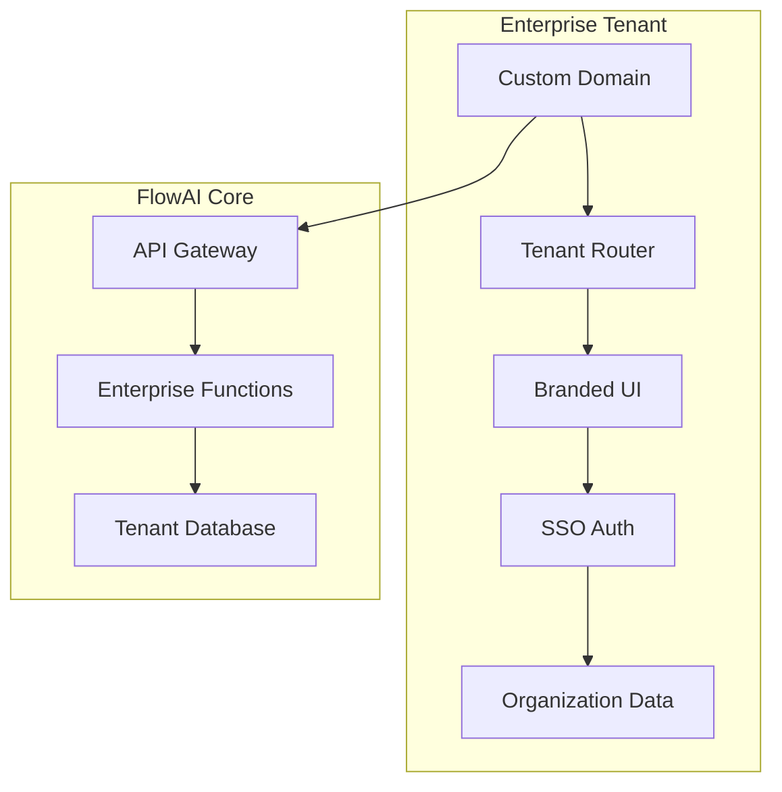

# 🏢 White-Label Enterprise Platform - Technical Documentation

> **Feature**: White-Label Enterprise Platform  
> **Version**: 1.0.0  
> **Last Updated**: 2025-12-08  
> **Status**: ✅ Implemented

---

## Overview

The White-Label Enterprise Platform enables organizations to deploy their own branded FlowAI instance with complete customization, SSO integration, team management, API access, and compliance-ready audit logging.

---

## Architecture



---

## Database Schema

| Table | Purpose | Key Fields |
|-------|---------|------------|
| `enterprise_tenants` | Organization settings | slug, branding, SSO config, features |
| `enterprise_users` | Team memberships | role, department, SSO ID |
| `enterprise_invitations` | Pending invites | token, expiry, role |
| `enterprise_audit_logs` | Compliance trail | action, resource, details |
| `enterprise_api_keys` | Integration access | scopes, rate limits |
| `enterprise_webhooks` | Event notifications | URL, events, secret |

### User Roles

| Role | Permissions |
|------|-------------|
| **owner** | Full control, billing, delete tenant |
| **admin** | All features except delete, API keys |
| **manager** | Invite users, manage projects |
| **member** | Create/edit own content |
| **viewer** | Read-only access |

---

## API Reference

**Endpoint**: `POST /functions/v1/enterprise-admin`

### Actions

| Action | Required Role | Description |
|--------|---------------|-------------|
| `get_tenant` | any member | Get tenant details |
| `update_tenant` | admin+ | Update branding/settings |
| `invite_user` | manager+ | Send invitation email |
| `remove_user` | admin+ | Deactivate user |
| `update_role` | admin+ | Change user role |
| `get_audit_logs` | admin+ | View audit trail |
| `create_api_key` | admin+ | Generate new API key |

### Example Request
```json
{
  "action": "invite_user",
  "tenant_id": "uuid",
  "data": {
    "email": "new@company.com",
    "role": "member"
  }
}
```

---

## SSO Configuration

Supported providers:
- SAML 2.0
- OpenID Connect (OIDC)
- Azure Active Directory
- Okta
- Google Workspace

Configure in tenant settings:
```json
{
  "sso_enabled": true,
  "sso_provider": "okta",
  "sso_metadata_url": "https://company.okta.com/...",
  "sso_entity_id": "flowai-company"
}
```

---

## Branding Options

| Setting | Description |
|---------|-------------|
| `logo_url` | Light mode logo |
| `logo_dark_url` | Dark mode logo |
| `favicon_url` | Browser favicon |
| `primary_color` | Brand accent color (#HEX) |
| `secondary_color` | Secondary accent |
| `font_family` | Custom font (Google Fonts) |
| `custom_domain` | e.g., studio.company.com |

---

## Files Created

| File | Purpose |
|------|---------|
| [20251208170300_white_label_enterprise.sql](file:///c:/Users/Manu/FlowAI/flowaicontent-10/supabase/migrations/20251208170300_white_label_enterprise.sql) | Database schema |
| [enterprise-admin/index.ts](file:///c:/Users/Manu/FlowAI/flowaicontent-10/supabase/functions/enterprise-admin/index.ts) | Admin API |
| [EnterpriseAdmin.tsx](file:///c:/Users/Manu/FlowAI/flowaicontent-10/src/pages/EnterpriseAdmin.tsx) | Admin dashboard |
| [WHITE_LABEL_ENTERPRISE.md](file:///c:/Users/Manu/FlowAI/flowaicontent-10/docs/WHITE_LABEL_ENTERPRISE.md) | This documentation |

---

## Deployment

```bash
# Apply migration
npx supabase db push

# Deploy function
npx supabase functions deploy enterprise-admin
```

### Route
- `/enterprise` - Enterprise admin dashboard

---

## Pricing Tiers

| Tier | Users | Storage | Monthly |
|------|-------|---------|---------|
| Enterprise | 100 | 500 GB | $2,000 |
| Enterprise Plus | 500 | 2 TB | $8,000 |
| Custom | Unlimited | Custom | Contact |

---

## Compliance Features

- ✅ SOC2-ready audit logging
- ✅ GDPR data residency options
- ✅ HIPAA BAA available
- ✅ Role-based access control
- ✅ API key scoping
- ✅ Activity monitoring
